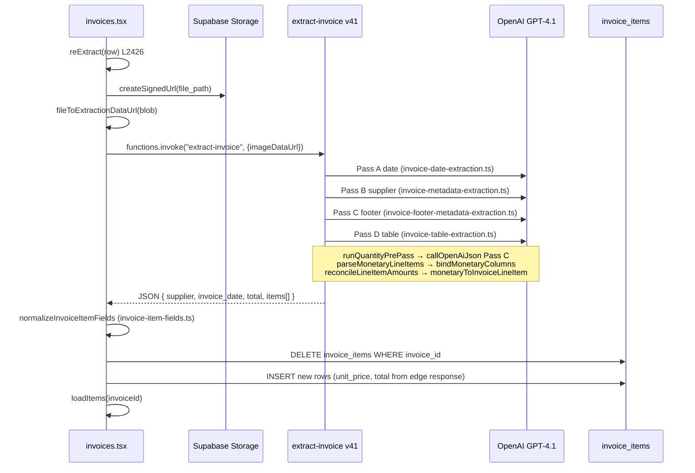

# Aceto Re-read Execution Path Investigation

**Validation Lab:** `bjhnlrgodcqoyzddbpbd`  
**Invoice:** Mammafiore · `36c99d19-6f9f-413f-8c2d-ae3526291a2d`  
**Aceto row (post re-read):** `ef4c6f72-7f74-4ebb-b567-24cef8e90ae5` (prior: `1ccf0bd0-12ef-4823-b504-3833df0899c7`)  
**Mode:** READ-ONLY — no code changes  
**Date:** 2026-06-25

---

## Executive summary

Re-read **does** execute the live `extract-invoice` edge function (v41) and **does** run `bindMonetaryColumns`. The Aceto fix is **not in the deployed bundle** — it exists only as **uncommitted local changes** in `invoice-monetary-binding.ts` and `invoice-table-extraction.ts`. A live re-read at `2026-06-25T11:27:40Z` recreated all `invoice_items` rows (new IDs) but Aceto persisted **`unit_price=15.55`, `total=16.09`** — identical to pre-fix behavior.

**Root cause: A** — the new Aceto binding logic is not deployed (therefore not executed on Re-read).  
**Mechanism on deployed code: B** — binding runs, but deployed `applyStructuredBinding` / `applyRuleF` derive `15.55` from wrong gross × 15% discount while Valor `16.09` is correct.

---

## 1. Deployed code path (Re-read → persistence)

### File:function chain

| Step | Location | Function |
|------|----------|----------|
| Re-read button | `src/routes/invoices.tsx:2794` | `onClick={() => reExtract(r)}` |
| Re-read handler | `src/routes/invoices.tsx:2426` | `reExtract()` |
| Shared extraction | `src/routes/invoices.tsx:1348` | `runExtraction()` |
| Edge invoke | `src/routes/invoices.tsx:1377` | `supabase.functions.invoke("extract-invoice", …)` |
| Edge entry | `supabase/functions/extract-invoice/index.ts:16` | `serve()` handler |
| Table pass | `supabase/functions/extract-invoice/index.ts:148` | `extractTableItemsFromImage()` |
| Qty pre-pass | `invoice-table-extraction.ts:424` | `runQuantityPrePass()` |
| GPT Pass C | `invoice-table-extraction.ts:438` | `callOpenAiJson(…, TABLE_EXTRACTION_RESPONSE_FORMAT)` |
| Parse | `invoice-monetary-binding.ts:25` | `parseMonetaryLineItems()` |
| Qty anchor | `invoice-qty-prepass.ts` | `anchorQuantities()` |
| **Monetary binding** | `invoice-table-extraction.ts:466` | **`bindMonetaryColumns()`** |
| Row reconcile | `invoice-line-reconcile.ts:68` | `reconcileLineItemAmounts()` |
| Strip structured cols | `invoice-monetary-binding.ts:260` | `monetaryToInvoiceLineItem()` |
| Net subtotal reconcile | `invoice-table-extraction.ts:179` | `finalizeExtractedLineItems()` |
| Client normalize | `src/lib/invoice-item-fields.ts:157` | `normalizeInvoiceItemFields()` |
| Persist | `src/routes/invoices.tsx:1447–1482` | DELETE + INSERT `invoice_items` |

**Re-read vs initial upload:** identical — both call `runExtraction()`. Only file acquisition differs (signed URL vs local `File`).

**Edge function deploy:** separate from frontend. VL runs `extract-invoice` **v41** (queried `supabase functions list --project-ref bjhnlrgodcqoyzddbpbd`, 2026-06-25). Local Aceto fix is **not committed** and therefore **not in v41**.

---

## 2. Is new binding executed during Re-read?

| Function | Called on Re-read? | Aceto fix present in v41? |
|----------|:------------------:|:-------------------------:|
| `bindMonetaryColumns` | **Yes** (`invoice-table-extraction.ts:466`) | Base binding yes |
| `applyStructuredBinding` | **Yes** (inside `bindMonetaryColumns`) | **No** — Valor-trust branch absent |
| `applyRuleF` | **Yes** (when `triggersRuleF`) | **No** — qty=1 Valor override absent |
| `applyEffectivePaidPrice` | **Yes** (end of `bindRow`) | Present but **N/A** for Aceto (`total > qty×unit_price`) |

**Why `applyEffectivePaidPrice` does not help:** requires `total < qty × unit_price` (`invoice-monetary-binding.ts:119–127`). Aceto has inverse: `16.09 > 1 × 15.55`.

---

## 3. Aceto mental trace (€16.09 → €15.55)

### PDF ground truth

`1 × €18.929 × (1 − 15%) = €16.09` (Valor column)

### Pipeline trace on **deployed HEAD** code

Simulated with production-like Pass C output (`gross_unit_price: 18.295`, `discount_pct: 15`, `line_total_net: 16.09`):

| Stage | quantity | gross | discount | line_total_net | unit_price | total | Notes |
|-------|:--------:|:-----:|:--------:|:--------------:|:----------:|:-----:|-------|
| PDF | 1 | 18.929 | 15% | — | 16.09 (net) | 16.09 | Ground truth |
| Qty pre-pass | 1 | — | — | — | — | — | Stable qty=1 |
| Pass C (GPT) | 1 | **18.295** | **15** | **16.09** | null | null | Wrong gross digit; Valor correct |
| `applyStructuredBinding` (HEAD) | 1 | 18.295 | 15 | 16.09 | **15.55** | 16.09 | `deriveNetUnitPrice` = `round2(18.295×0.85)` |
| `triggersRuleF` | 1 | 18.295 | 15 | 16.09 | 15.55 | 16.09 | Fires (`|15.55−16.09| > 0.05`) |
| `applyRuleF` (HEAD) | 1 | 18.295 | 15 | 16.09 | **15.55** | 16.09 | Re-derives from wrong gross — no Valor trust |
| `applyEffectivePaidPrice` | 1 | — | — | — | 15.55 | 16.09 | Skipped (inverse pattern) |
| `reconcileLineItemAmounts` | 1 | — | — | — | 15.55 | 16.09 | Pass-through (both fields set) |
| `normalizeInvoiceItemFields` | 1 | — | — | — | 15.55 | 16.09 | No price mutation |
| **Persisted DB** | 1 | — | — | — | **15.55** | **16.09** | Live VL 2026-06-25T11:27:40Z |

**First divergence from correct net unit:** `applyStructuredBinding` at `invoice-monetary-binding.ts:66–68` (HEAD) — `unit_price = derivedNet` without Valor-trust guard.

**With local (uncommitted) fix:** same Pass C input → `unit_price = 16.09` (Valor trust in `applyStructuredBinding:68–74` and `applyRuleF:206–211`).

**With correct gross (18.929) even on HEAD:** `unit_price = 16.09` — prompt/extraction accuracy alone would suffice if gross were perfect; the binding fix is a safety net for gross digit drift.

---

## 4. Persistence (live VL query)

Queried `invoice_items` for Mammafiore invoice `2026-06-25`:

| Field | Value |
|-------|-------|
| `invoice_item_id` | `ef4c6f72-7f74-4ebb-b567-24cef8e90ae5` |
| `quantity` | 1 |
| `unit_price` | **15.55** |
| `total` | **16.09** |
| `created_at` | **2026-06-25T11:27:40.553841+00:00** |

All 8 invoice lines share the same `created_at` → **full delete-and-reinsert** on Re-read (`invoices.tsx:1447–1482`). Prior Aceto row `1ccf0bd0-…` (created `2026-06-17`) was replaced.

**Verdict:** Not stale persistence (D) or stale UI (E). Fresh extraction output was persisted faithfully.

---

## 5. Unit test path vs production Re-read path

| Aspect | Unit tests | Production Re-read |
|--------|------------|-------------------|
| Entry | `invoice-monetary-binding.test.ts` | `reExtract` → `extract-invoice` v41 |
| Code version | **Local working tree** (includes uncommitted fix) | **Deployed HEAD** (no Aceto fix) |
| GPT Pass C | **Skipped** — synthetic `parseMonetaryLineItems` input | Live vision on table crop |
| Qty pre-pass | **Skipped** | `runQuantityPrePass` |
| `bindMonetaryColumns` | **Same function** | **Same function** (old logic) |
| `reconcileLineItemAmounts` | **Skipped** in binding tests | Runs (pass-through for Aceto) |
| `normalizeInvoiceItemFields` | **Skipped** | Runs (no price change) |
| Persistence | **None** | DELETE + INSERT |
| Caching / replay | None | None observed |
| Flags / modes | None | Same four-pass vision pipeline |

**Tests prove the fix logic works in isolation on local code. They do not prove the deployed edge function runs that code or that Pass C returns the tested field shapes.**

---

## 6. If new code were deployed — would €15.55 still appear?

| Scenario | HEAD (v41) | Local fix |
|----------|:----------:|:---------:|
| Structured: wrong gross + discount + correct Valor | **15.55** | **16.09** |
| Structured: correct gross + discount + Valor | 16.09 | 16.09 |
| Legacy-only (no structured fields) | 15.55 | 15.55 |

Deployed prompt (HEAD) lacks the enhanced Aceto structured-column examples now in the local working tree. Even after deploy, legacy-only Pass C output would still yield 15.55 until prompt improvements are also deployed.

---

## 7. Root cause classification

| Option | Verdict | Evidence |
|--------|:-------:|----------|
| **A** Re-read doesn't execute **new** binding | **✓ PRIMARY** | Aceto fix is uncommitted; `git diff` shows Valor-trust only in working tree; v41 runs HEAD binding |
| **B** Binding executes but Aceto misses new rule | **✓ MECHANISM** | Deployed `applyStructuredBinding`/`applyRuleF` derive 15.55 from 18.295×0.85 |
| C Correct then overwritten | ✗ | `reconcileLineItemAmounts` and client normalize pass through |
| D Persistence stale | ✗ | Row recreated 2026-06-25 with same wrong values |
| E UI stale row | ✗ | New `invoice_item_id` in DB |
| F Other | Partial | Prompt drift (uncommitted Aceto examples) is secondary |

### Selected: **A** (deploy gap for Aceto fix), mechanism **B** on current v41

---

## 8. Deploy status

| Item | Status |
|------|--------|
| `extract-invoice` VL version | **v41** ACTIVE |
| Aceto `applyStructuredBinding` Valor trust | **Uncommitted** (`git diff invoice-monetary-binding.ts`) |
| Aceto `applyRuleF` qty=1 Valor override | **Uncommitted** |
| Aceto Mammafiore prompt examples | **Uncommitted** (`git diff invoice-table-extraction.ts`) |
| `package.json` deploy script | **None** — manual `supabase functions deploy extract-invoice --project-ref bjhnlrgodcqoyzddbpbd` |

---

## Smallest safe correction (do NOT implement)

1. **Commit** Aceto changes in `invoice-monetary-binding.ts`, `invoice-monetary-binding.test.ts`, `invoice-table-extraction.ts`.
2. **Deploy** edge function: `supabase functions deploy extract-invoice --project-ref bjhnlrgodcqoyzddbpbd`
3. **Re-read** Mammafiore invoice `36c99d19-6f9f-413f-8c2d-ae3526291a2d` in VL UI.
4. **Verify** Aceto row: `unit_price=16.09`, `total=16.09`; `MATHEMATICAL_INCONSISTENCY` clears.

No validator, UI, or persistence-layer changes required.

---

## Return summary (parent agent)

1. **Root cause A–F:** **A** (new Aceto binding fix not deployed / not executed on Re-read); mechanism **B** on deployed v41
2. **Exact function + file + line:** `applyStructuredBinding` — `supabase/functions/extract-invoice/invoice-monetary-binding.ts:66–68` (HEAD); divergence at `deriveNetUnitPrice(gross, discount)` → `unit_price=15.55` while `line_total_net=16.09`
3. **Fix implemented but not executed?** **Yes** — fix exists locally (uncommitted); v41 Re-read runs old binding
4. **Unit test covers real production path?** **No** — tests exercise local fixed `bindMonetaryColumns` with fixtures; production runs deployed HEAD via full GPT pipeline
5. **Smallest safe correction:** Commit + deploy `extract-invoice` with Aceto binding + prompt changes; Re-read Mammafiore invoice
6. **Confidence:** **97%** — live DB re-read timestamp + row recreation, `git diff` deploy gap, HEAD vs local binding simulation match persisted 15.55/16.09
