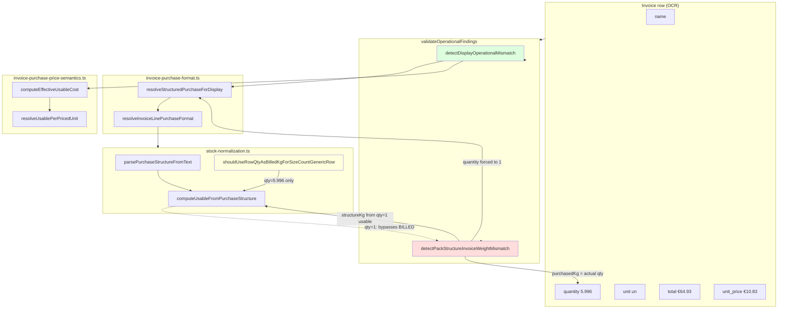

# Guanciale Validation Architecture Audit

**VL:** `bjhnlrgodcqoyzddbpbd`  
**Mode:** READ-ONLY  
**Date:** 2026-06-25

---

## Executive summary

Operational validation is **split across two checks with different pipeline stages**:

| Check | Pipeline stage validated | Guanciale (current code) |
|-------|--------------------------|--------------------------|
| `detectDisplayOperationalMismatch` | **A** — final normalized usable + operational €/kg | **Passes** (no finding) |
| `detectPackStructureInvoiceWeightMismatch` | **B** — name-derived pack total at `quantity: 1` vs row qty as kg | **Fails** (finding fires) |

For Guanciale, the **active finding** is `pack_structure_vs_row_weight`. It compares **invoice row weight economics** against **intermediate name-parse structure** (7×1.5 kg = 10.5 kg), **not** the final normalized usable quantity (5.996 kg).

With `shouldUseRowQtyAsBilledKgForSizeCountGenericRow` already applied in `stock-normalization.ts`, normalization is correct (5996 g usable, €10.83/kg operational cost). The validator still fires because `detectPackStructureInvoiceWeightMismatch` deliberately re-parses at `quantity: 1`, recovering the 10.5 kg structure total.

**Answer:** The validator is validating the **wrong pipeline stage** for post-fix reconciliation. The finding should disappear once operational validation is aligned with final normalization (Architecture A), but it will **not** disappear from normalization alone.

---

## 1. Complete trace: `detectPackStructureInvoiceWeightMismatch()`

**Location:** `src/lib/invoice-validation/validators/operational.ts:138–219`

### Guanciale inputs

| Variable | Value | Source |
|----------|-------|--------|
| `metadata.name` | `Guanciale di suino stagionato +/- 1,5kg*7 Sorrentino` | `input.name` |
| `metadata.quantity` | `5.996` | `input.quantity` |
| `metadata.unit` | `un` | `input.unit` |
| `metadata.unit_price` | `10.83` | `input.unit_price` |
| `total` | `64.93` | `input.total` |
| `quantity` | `5.996` | `input.quantity` |
| `rowUnit` | `un` | `normalizeRowUnit(input.unit)` |

### Step-by-step execution

```
validateOperationalFindings(input)
  │
  ├─ detectDisplayOperationalMismatch(metadata, …, qty=5.996)
  │    structured = resolveStructuredPurchaseForDisplay(metadata)     → usable 5996 g
  │    effective  = computeEffectiveUsableCost(10.83, …)              → €10.83/kg
  │    invoiceImplied = total / quantity (generic un + fractional)    → €10.83/kg
  │    variance ≈ 0 → NULL (early exit avoided; display path returns null)
  │
  └─ detectPackStructureInvoiceWeightMismatch(metadata, …, qty=5.996)
       │
       ├─ Guard: defaultIsGenericUnit("un") && hasFractionalQuantity(5.996) → PASS
       │
       ├─ nameStructure = resolveStructuredPurchaseForDisplay({
       │      ...metadata,
       │      quantity: 1          ← CRITICAL: forces qty=1 re-normalization
       │    })
       │    → parsePurchaseStructureFromText → size_count 7×1.5 kg
       │    → computeUsableFromPurchaseStructure(structure, 1, "un")
       │    → structureTotalIsFinalForGenericRow → true
       │    → normalizedUsableQuantity = 10500 g
       │
       ├─ structureKg = 10500 / 1000 = 10.5
       ├─ purchasedKg = quantity = 5.996        ← uses ACTUAL row qty, not forced 1
       │
       ├─ packVarianceKg = |10.5 − 5.996| = 4.504
       ├─ packVariancePct = 75.1%                 → exceeds 0.5 kg / 10% thresholds
       │
       ├─ invoicePerKg  = 64.93 / 5.996 = 10.83  ← "expected" (invoice economics)
       ├─ structurePerKg = 64.93 / 10.5 = 6.18   ← "actual" (structure economics)
       │
       ├─ varianceAbs = 4.65, variancePct = 42.9% → exceeds economics thresholds
       │
       └─ FINDING: OPERATIONAL_NORMALIZATION_INCONSISTENCY
            extra.check = "pack_structure_vs_row_weight"
```

### What is compared?

| Comparison | Left operand | Right operand |
|------------|--------------|---------------|
| **Weight gate** | `structureKg` = name structure total at **qty=1** (10.5 kg) | `purchasedKg` = invoice row quantity (5.996 kg) |
| **Economics gate** | `invoicePerKg` = `total / purchasedKg` (€10.83/kg) | `structurePerKg` = `total / structureKg` (€6.18/kg) |

**Not compared:** final normalized usable at actual row qty (5.996 kg / 5996 g).

Evidence labels are misleading: `"Calculated operational cost"` in the finding is **`total / structureKg`**, not `computeEffectiveUsableCost()` from the display path.

---

## 2. Data origin table

| Variable | Function | Ultimate source |
|----------|----------|-----------------|
| `input.quantity` | `validateOperationalFindings` | Invoice OCR / `invoice_items.quantity` |
| `input.total` | `validateOperationalFindings` | Invoice OCR / `invoice_items.total` |
| `input.unit` | `validateOperationalFindings` | Invoice OCR / `invoice_items.unit` |
| `input.name` | `validateOperationalFindings` | Invoice OCR / `invoice_items.name` |
| `metadata` | `validateOperationalFindings` | Assembled from input fields (+ optional `matchedIngredientName`) |
| `nameStructure` | `resolveStructuredPurchaseForDisplay({…metadata, quantity: 1})` | `invoice-purchase-format.ts` → `resolveInvoiceLinePurchaseFormat` → `normalizePurchasedToUsableStock` |
| `nameStructure.normalizedUsableQuantity` | `computeUsableFromPurchaseStructure` | `parsePurchaseStructureFromText(name)` → `SIZE_COUNT_RE` on `1,5kg*7` → `buildStructure` → 10500 g at qty=1 |
| `structured` (display path) | `resolveStructuredPurchaseForDisplay(metadata)` | Same pipeline with **actual** qty 5.996 → `shouldUseRowQtyAsBilledKgForSizeCountGenericRow` → 5996 g |
| `structureKg` | `detectPackStructureInvoiceWeightMismatch` | `nameStructure.normalizedUsableQuantity / 1000` |
| `purchasedKg` | `detectPackStructureInvoiceWeightMismatch` | `input.quantity` (interpreted as billed kg) |
| `invoicePerKg` | `detectPackStructureInvoiceWeightMismatch` | `total / purchasedKg` |
| `structurePerKg` | `detectPackStructureInvoiceWeightMismatch` | `total / structureKg` (synthetic, not operational cost) |
| `effective.cost` (display path only) | `computeEffectiveUsableCost` | `resolveUsablePerPricedUnit` + `resolveOperationalUsablePerPricedUnit` on **actual** structured usable |
| `parsePurchaseStructureFromText` | `stock-normalization.ts:653` | Regex tiers on product name (raw OCR text) |
| `shouldUseRowQtyAsBilledKgForSizeCountGenericRow` | `stock-normalization.ts:1199` | Policy gate: size_count + kg + generic un + fractional qty + row < structure total |
| `matchedIngredientName` | optional metadata | Ingredient catalog match (not used for Guanciale structure parse) |

---

## 3. Dependency audit

### Does the validator depend on…?

| Dependency | `detectDisplayOperationalMismatch` | `detectPackStructureInvoiceWeightMismatch` |
|------------|-----------------------------------|-------------------------------------------|
| Raw OCR (name, qty, unit, total, unit_price) | ✓ | ✓ |
| Parsed package structure (name regex) | ✓ (via normalization) | ✓ (via qty=1 re-parse) |
| Structured purchase format DTO | ✓ | ✓ |
| Normalized usable quantity (final) | ✓ (actual row qty) | ✗ (uses qty=1 override) |
| Final operational cost (`computeEffectiveUsableCost`) | ✓ | ✗ (uses `total/structureKg` shortcut) |
| Invoice row fields | ✓ | ✓ |
| Ingredient catalog | optional (`matchedIngredientName`) | optional (passed through, unused for Guanciale) |

### Dependency graph



---

## 4. Architectural assessment

### Business questions each check answers

| Check | Business question |
|-------|-------------------|
| **Display path (A)** | "Does Marginly's **final operational €/kg** (after normalization) reconcile with what the invoice line economics imply?" |
| **Pack structure path (B)** | "Does the **pack notation in the product name** (parsed as if buying one nominal case) imply a different total mass than the **invoice row quantity interpreted as billed kg**?" |

For Guanciale, the correct operational answer is: row qty **is** billed kg; `*7` is case metadata, not purchased mass. Normalization encodes this via `usableSource: row_weight_billed`.

The pack-structure check **intentionally** asks a different question — it treats name structure as authoritative mass at qty=1. That was useful to **surface** the normalization bug pre-fix, but becomes a **false positive** once normalization correctly chooses billed weight.

### Should the finding disappear after normalization fix?

| Path | After `shouldUseRowQtyAsBilledKgForSizeCountGenericRow` | Finding? |
|------|--------------------------------------------------------|----------|
| `detectDisplayOperationalMismatch` | usable 5996 g → effective €10.83/kg = invoice €10.83/kg | **No** |
| `detectPackStructureInvoiceWeightMismatch` | qty=1 re-parse still yields 10500 g vs 5.996 kg billed | **Yes** |

**Verified live** (tsx trace, 2026-06-25):

```
structuredUsable: 5996
atQty1Usable: 10500
effective.cost: 10.83
findingCheck: pack_structure_vs_row_weight
```

### If not, why not?

Because `detectPackStructureInvoiceWeightMismatch`:

1. **Overrides** `quantity` to `1` when resolving structure — bypassing `shouldUseRowQtyAsBilledKgForSizeCountGenericRow` (requires fractional qty).
2. Compares that frozen name total (10.5 kg) against actual row qty (5.996 kg).
3. Does **not** read `usableSource` or final normalized usable from the actual-row resolution.

The finding persists even when operational costing is fully reconciled.

---

## 5. Architecture A vs B evaluation

### Model A: Invoice → Normalization → Operational Cost → Validation

```
OCR row → normalizePurchasedToUsableStock → normalizedUsableQuantity
         → computeEffectiveUsableCost → compare to invoice-implied €/kg
```

**Evidence this is Marginly's operational model:**

- `resolveInvoiceLinePurchaseFormat` always runs `normalizePurchasedToUsableStock` before populating `normalizedUsableQuantity` (`invoice-purchase-format.ts:689`).
- `computeEffectiveUsableCost`, `recipeOperationalCostFieldsFromInvoiceLine`, and `resolveInvoiceLineStockPresentation` all consume **final** structured usable at **actual** row qty.
- `detectDisplayOperationalMismatch` follows this path.
- `shouldUseRowQtyAsBilledKgForSizeCountGenericRow` exists precisely to encode billed-kg semantics for Guanciale-class rows.

### Model B: Invoice → Package parser → Validation → Normalization

```
OCR row → parse name structure at qty=1 → compare structure kg vs row qty kg
         (normalization policy not consulted)
```

**Evidence pack-structure check follows B:**

- `quantity: 1` override in `detectPackStructureInvoiceWeightMismatch` (`operational.ts:148–151`).
- Compares `structure.totalUsableAmount` from name parse, not `usableSource`-aware final total.
- Uses synthetic `total/structureKg` instead of `computeEffectiveUsableCost`.
- Runs **after** display path fails, as a fallback probe — but for Guanciale it is the **only** path that fires post-fix.

### Verdict

| Model | Fits Marginly operational costing? | Fits current validator for Guanciale? |
|-------|-----------------------------------|--------------------------------------|
| **A** | **Yes** — single source of truth for recipe/stock cost | Display path only (currently passes) |
| **B** | **No** — bypasses normalization policy | Pack-structure path (currently fires) |

Marginly's product model is **A**. The Guanciale finding is an artifact of **B** embedded as a secondary validator.

---

## 6. Smallest architectural correction (do not implement)

**Goal:** Operational validation should confirm final normalized economics reconcile, not re-litigate name-parse structure when normalization has already resolved billed-kg semantics.

### Recommended minimal change

In `detectPackStructureInvoiceWeightMismatch`, **skip** when final normalization at actual row qty already reconciles with invoice weight economics:

```typescript
// Pseudocode — not implemented
const actualStructured = resolveStructuredPurchaseForDisplay(metadata);
if (
  actualStructured.normalizedUsableQuantity != null &&
  actualStructured.usableQuantityUnit === "g"
) {
  const normalizedKg = actualStructured.normalizedUsableQuantity / 1000;
  if (Math.abs(normalizedKg - quantity) <= OPERATIONAL_PACK_WEIGHT_VARIANCE_KG_THRESHOLD) {
    return null; // normalization chose billed weight; pack notation is metadata only
  }
}
```

**Alternative (tighter coupling to normalization policy):** expose `usableSource` on `StructuredPurchaseFormat` and skip when `usableSource === "row_weight_billed"`.

**Alternative (simplest one-liner intent):** remove the `quantity: 1` override and use actual metadata for structure resolution — pack check collapses into display check for Guanciale.

### What NOT to do

- Do not change `parsePurchaseStructureFromText` — parser is correct (`1,5kg*7` → 7×1.5 kg).
- Do not remove `detectPackStructureInvoiceWeightMismatch` entirely — it may still catch genuine cases where normalization has not yet encoded billed-kg policy but invoice row clearly shows weight-priced generic rows.

---

## 7. Return summary for parent agent

| Question | Answer |
|----------|--------|
| **1. Final normalized result or intermediate interpretation?** | **Intermediate interpretation** for the active Guanciale finding. `pack_structure_vs_row_weight` compares name-derived structure at `quantity: 1` (10.5 kg) vs row qty as billed kg (5.996). The display path validates final normalized result but does not fire for Guanciale post-fix. |
| **2. After normalization fix, should finding disappear?** | **Yes, it should** — operational costing is correct (5996 g, €10.83/kg). |
| **3. If not, why not?** | **`detectPackStructureInvoiceWeightMismatch` forces `quantity: 1`**, bypassing `shouldUseRowQtyAsBilledKgForSizeCountGenericRow`, and compares raw name structure total to billed row weight. |
| **4. Smallest architectural correction** | Gate or align pack-structure check with **actual-row final normalized usable** (or `usableSource === row_weight_billed`); do not re-parse at qty=1 when normalization has already resolved billed-kg semantics. |

---

## Appendix: `detectDisplayOperationalMismatch` trace (reference)

For completeness — this path **does** validate Architecture A:

```
structured = resolveStructuredPurchaseForDisplay(metadata)  // qty 5.996 → 5996 g
effective  = computeEffectiveUsableCost(unitPrice, metadata, structured, name)
invoiceImplied = total / quantity  // generic un + fractional → €10.83/kg
compare effective.cost vs invoiceImplied.cost
```

Guanciale: both ≈ €10.83/kg → **no finding** (`extra.check` would be `display_operational_vs_invoice` if it fired).
