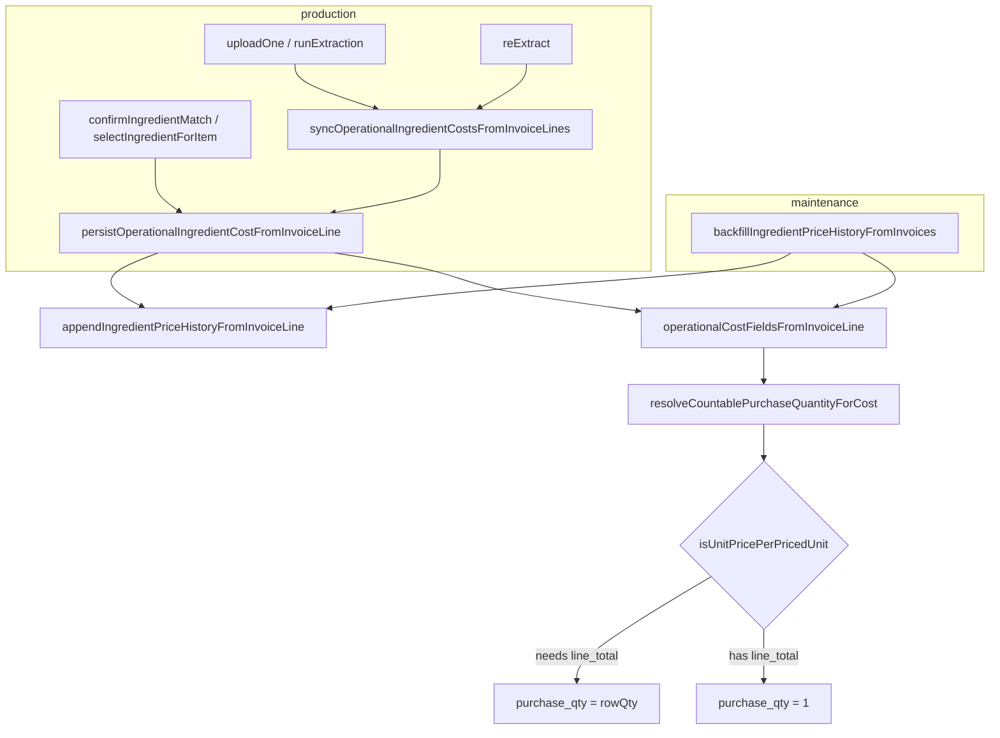

# Caller Trace — `appendIngredientPriceHistoryFromInvoiceLine()`

**Mode:** Read-only implementation prep  
**Date:** 2026-06-16  
**Target:** `src/lib/ingredient-price-history.ts:458`

---

## Direct callers (2)

| # | File | Function | How invoked | `line_total` / `total` at cost-compute layer? |
|---|------|----------|-------------|-----------------------------------------------|
| D1 | `src/lib/ingredient-auto-persist.ts` | `persistOperationalIngredientCostFromInvoiceLine` (L101–165) | Production persist path | **NO** — item type is `Pick<AutoPersistInvoiceItem, "name" \| "quantity" \| "unit" \| "unit_price">` (L104); `total` never passed to `operationalCostFieldsFromInvoiceLine` (L113) |
| D2 | `src/lib/ingredient-price-history-backfill.ts` | `backfillIngredientPriceHistoryFromInvoices` (L62–210) | Maintenance backfill script | **NO** — DB select omits `invoice_items.total` (L84–86); `operationalCostFieldsFromInvoiceLine` called without `total` (L175–177) |

### D1 — Arguments passed to `appendIngredientPriceHistoryFromInvoiceLine` (L142–155)

Computed **after** contaminated `operationalCostFieldsFromInvoiceLine`:

| Param | Source |
|-------|--------|
| `ingredientId` | caller `ingredientId` |
| `invoiceId` | `options.priceHistory.invoiceId` |
| `ingredientName` | snapshot or `item.name` |
| `ingredientUnit` | snapshot |
| `supplierName` | `options.priceHistory.supplierName` |
| `previousPrice` | `resolvePreviousPackPriceForHistory(snapshot)` |
| `previousOperationalPrice` | `resolvePreviousOperationalPriceForHistory(...)` |
| `newPrice` | `fields.current_price` ← **pack price from invoice `unit_price`** |
| `previousPurchaseQuantity` | snapshot |
| `newPurchaseQuantity` | `fields.purchase_quantity` ← **wrong when multi-`un` without total** |
| `invoiceDate` / `invoiceCreatedAt` | `options.priceHistory` |

`appendIngredientPriceHistoryFromInvoiceLine` then applies `operationalUnitPriceForPriceHistory(newPrice, newPurchaseQuantity)` (L477–478) → **double-divide** when `purchase_quantity = rowQty` on per-item-priced lines.

### D2 — Arguments (L184–196)

Same shape as D1 but calls `append` directly (no `ingredients` update). `newPrice` / `newPurchaseQuantity` from `operationalCostFieldsFromInvoiceLine(row.normalized)` without `total`.

---

## Indirect production paths → D1

### Path 1 — Invoice upload extract

```
src/routes/invoices.tsx
  uploadOne (L~1638)
    → runExtraction(invoiceId, dataUrl) (L1344)
      → invoice_items.insert includes total (L1461) ✅ stored in DB
      → syncOperationalIngredientCostsFromInvoiceLines (L1486)
          items map: { name, quantity, unit, unit_price, supplierName } (L1490–1495)
          ❌ total dropped before sync
        → persistOperationalIngredientCostFromInvoiceLine (ingredient-operational-intelligence.ts L996)
        → appendIngredientPriceHistoryFromInvoiceLine (ingredient-auto-persist.ts L142)
```

| Field at sync boundary | Present? |
|------------------------|----------|
| `quantity` | ✅ |
| `unit` | ✅ |
| `unit_price` | ✅ |
| `total` / `line_total` | ❌ |

### Path 2 — Invoice re-extract (re-read)

```
src/routes/invoices.tsx
  reExtract(row) (L2393)
    → runExtraction(row.id, dataUrl) (L2403)
      → delete + re-insert invoice_items (total persisted L1461) ✅
      → syncOperationalIngredientCostsFromInvoiceLines (L1486) — same gap as Path 1
```

Re-extract uses **refresh** branch in `appendIngredientPriceHistoryFromInvoiceLine` when `(invoice_id, ingredient_id)` exists (L473–555) → **overwrites repaired rows** with recomputed contaminated `new_price`.

### Path 3 — Match confirmation / manual ingredient selection

```
src/routes/invoices.tsx
  confirmIngredientMatch (L2047)
    → persistIngredientCorrectionForItem (L2065)
  selectIngredientForItem (L2095)
    → persistIngredientCorrectionForItem (L2138 / L2271 / L2348)

  persistIngredientCorrectionForItem (L1867)
    → persistOperationalIngredientCostFromInvoiceLine (L1947)
        item: { name, quantity, unit, unit_price } from ItemRow (L1950–1954)
        ❌ ItemRow has total but it is not passed
    → appendIngredientPriceHistoryFromInvoiceLine
```

`confirmMatch` in `src/lib/match-lifecycle-service.ts` does **not** call pricing — only alias/match lifecycle writes.

### Path 4 — Ingredient operational sync (library entry)

```
src/lib/ingredient-operational-intelligence.ts
  syncOperationalIngredientCostsFromInvoiceLines (L952)
    for each item in InvoiceLineOperationalCostSyncInput (L916–922 — no total field)
      → persistOperationalIngredientCostFromInvoiceLine (L996–1004)
      → appendIngredientPriceHistoryFromInvoiceLine
```

Single library entry used by Path 1 and Path 2.

---

## Related path (does NOT reach `append`, but same root gap)

```
src/lib/ingredient-operational-intelligence.ts
  buildLatestOperationalIngredientCostByIngredientIdFromScan (L~820)
    → operationalCostFieldsFromInvoiceLine without total (L878–883)
```

Affects operational cost **overlay display**, not history writes. Should be fixed for consistency but is out of `append` call chain.

---

## Test-only direct callers

| File | Notes |
|------|-------|
| `src/lib/ingredient-price-history-persistence.test.ts` | Direct `append` + `persist` tests; Gema re-extract test (L429–475) asserts **÷6 behavior** (documents bug) |

---

## Call graph (summary)



---

## Verdict

| Question | Answer |
|----------|--------|
| Total production paths to `append`? | **2** direct; **3** indirect via `persist` (+ 1 backfill) |
| Paths missing `total`? | **All production paths** |
| Fix locus already exists? | `isUnitPricePerPricedUnit` in `invoice-purchase-price-semantics.ts:180–194` — gated on `metadata.line_total` |
