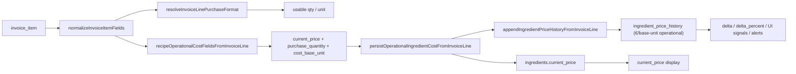

# Pipeline Trace — Historical Pricing Validation Phase 1

**Queried:** VL project `bjhnlrgodcqoyzddbpbd` · 2026-06-14  
**Mode:** Read-only (live DB via `.env.local` service role; no code/commits)

## End-to-end flow



## Stage detail

| Stage | Module | Output |
|---|---|---|
| **1. Raw line** | `invoice_items` | `name`, `quantity`, `unit`, `unit_price`, `total` |
| **2. Normalize** | `normalizeInvoiceItemFields` | Parsed qty/unit from OCR tail; cleaned name |
| **3. Usable stock** | `resolveInvoiceLinePurchaseFormat` → `normalizePurchasedToUsableStock` | `normalizedUsableQuantity` + `usableQuantityUnit` (g/ml/un) — **stock only, not always used for costing** |
| **4. Operational cost** | `recipeOperationalCostFieldsFromInvoiceLine` | Pack price + `purchase_quantity` + `cost_base_unit` (g/ml/un) |
| **5. Persist catalog** | `persistOperationalIngredientCostFromInvoiceLine` | Updates `ingredients.current_price`, `purchase_quantity` |
| **6. History** | `appendIngredientPriceHistoryFromInvoiceLine` | Stores **operational** €/base-unit: `new_price = pack / purchaseQuantityDenom(pq)`; `ingredient_unit` from catalog snapshot |
| **7. current_price revert** | `revertIngredientCurrentPriceFromHistory` | `current_price = latest_linked_new_price × pq` |

## Key formulas

```149:159:src/lib/ingredient-price-history.ts
export function operationalUnitPriceForPriceHistory(
  packPrice: number | null | undefined,
  purchaseQuantity: number | null | undefined,
): number | null {
  // ...
  return resolvedOperationalUnitCostEur({
    current_price: pack,
    purchase_quantity: purchaseQuantityDenom(purchaseQuantity),
  });
}
```

```89:100:src/lib/ingredient-price-history.ts
export function computePriceHistoryDelta(
  previousPrice: number | null,
  newPrice: number,
): { delta: number | null; delta_percent: number | null } {
  // delta = next - prev; delta_percent = (delta/prev)*100
}
```

## Countable vs weight paths

- **`cx`/pack containers** → `purchase_quantity` from name structure (e.g. `6X720g` → 6, `12x1kg` → 12) ✅
- **`un` with qty > 1** → `purchase_quantity = row quantity` → **divides unit_price again** ⚠️
- **`kg` row unit** → `purchase_quantity = 1000`, base `g` ✅
- **`1 Kg` in name but row unit `un`** → classified countable, not weight → **wrong base** ⚠️

## Triggers

- Live match confirm: `invoices.tsx` → `persistOperationalIngredientCostFromInvoiceLine` with `priceHistory` context
- Invoice ingest: `syncOperationalIngredientCostsFromInvoiceLines` (extract gate for confirmed only when flag ON)
- Backfill: `backfillIngredientPriceHistoryFromInvoices` — skips only `unmatched`, **includes `suggested`** ⚠️

## Prior investigation context

- `.tmp/historical-pricing-investigation/` — not present at audit time
- `.tmp/match-lifecycle-phase5-validation/PRICING_RECONCILIATION.md` — Pepino/Arroz cx paths validated
- `.tmp/match-lifecycle-phase5b-validation/HISTORY_VALIDATION.md` — history insert math validated
- `.tmp/pepino-live-validation/baseline.json` — Bidfood poison row cleaned
- `.tmp/anchovas-persistence-paradox/FINAL_VERDICT.md` — alias persistence, not pricing corruption
