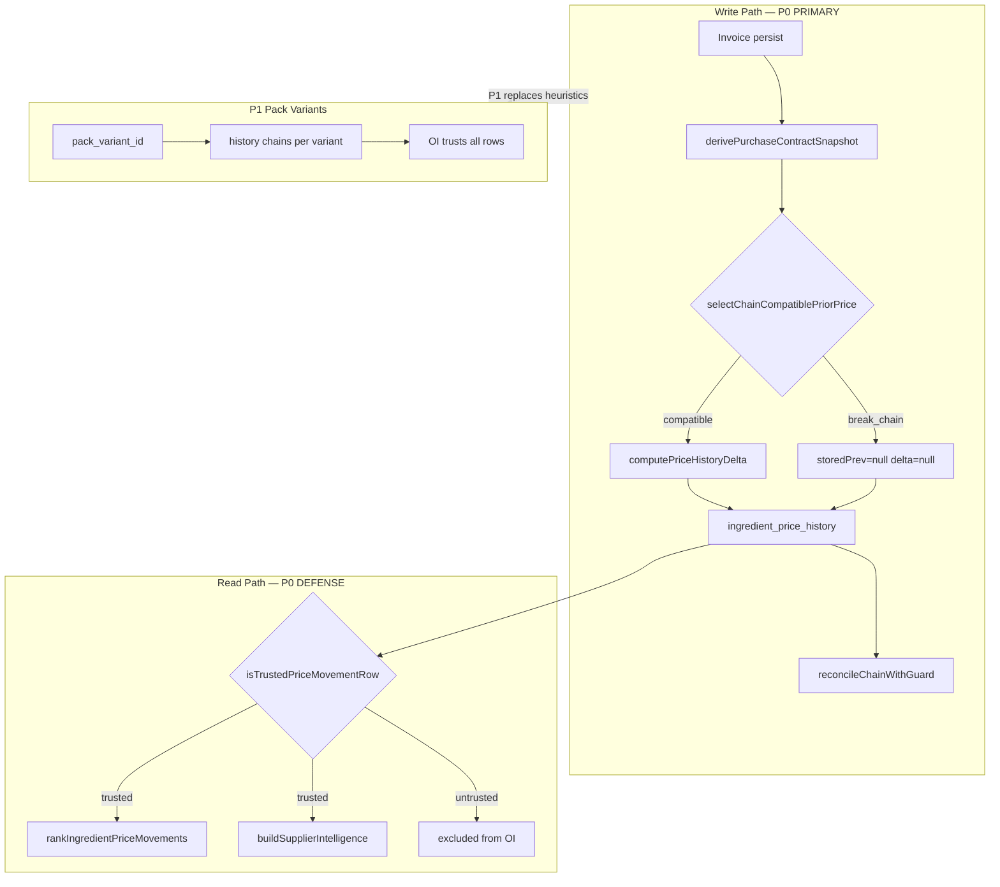

# P0 Identity Guard — Design Audit

**Generated:** 2026-06-13  
**Mode:** READ-ONLY design audit — no code, deploy, commit, or implementation.

---

## Executive Summary

Marginly's VL failures (Mozzarella **+1341%**, Pepino **−99.95%**, Ginger Beer **€575/L**) originate at **history chain selection**, not synthesis math. The smallest P0 guard is a **cross-format chain breaker** in `ingredient-price-history.ts` plus **read-path filters** in OI — **no new schema required**.

**Estimated effort:** 1–2 days, 9 files (~510 LOC new, ~140 modified).

---

## Primary Question

**What is the smallest P0 guard that prevents invalid historical pricing chains and false OI?**

A single new module (`ingredient-price-chain-guard.ts`) implementing **five core rules**:

| Rule | Signal | Action |
|------|--------|--------|
| **R1** Unit family mismatch | weight vs countable vs volume | Break chain |
| **R2** Countable vs weight contract | piece/case vs kg/g pricing | Break chain |
| **R3** Extreme operational ratio | >25× with mismatch; >100× hard | Break chain |
| **R5** Preservation class mismatch | conserva vs fresco | Break chain |
| **R7** Beverage volume sanity | €/L > 50 or pack < 50ml | Block insert |

Defense-in-depth: **R4** form ontology, **R6** pack weight magnitude, **R8** contract key.

**On break:** `storedPrev = null`, `delta = null`, `delta_percent = null` — semantic label `format_change` (new price baseline, not a movement).

---

## Pipeline Map: Purchase A → ingredient_id → Purchase B

```
invoice line (purchase A)
    ↓ persistOperationalIngredientCostFromInvoiceLine
ingredients.current_price updated
    ↓ appendIngredientPriceHistoryFromInvoiceLine
fetchPriorLinkedHistoryNewPrice  ← ⚠ NO FORMAT CHECK TODAY
    ↓
computePriceHistoryDelta → ingredient_price_history row
    ↓ reconcileIngredientPriceHistoryChain (re-extract)
    ↓
buildOperationalAlertItems (price_increase/decrease)
    ↓
rankIngredientPriceMovements → financialRisks / opportunities
buildSupplierMovementGroups → supplier watch
buildSupplierIntelligence → betterSupplierLine
```

### Where each comparison happens

| Step | File | Prior selected | Movement % | OI consumes |
|------|------|----------------|------------|-------------|
| Append | `ingredient-price-history.ts` | `fetchPriorLinkedHistoryNewPrice` | `computePriceHistoryDelta` | — |
| Reconcile | `ingredient-price-history-reconcile.ts` | prior row `new_price` | `computePriceHistoryDelta` | — |
| Alerts | `margin-alert-data.ts` | latest history row | `getHistoryPercent` | price_increase/decrease |
| Risks/Opps | `operational-intelligence-synthesis.ts` | each row `delta_percent` | `priceHistoryDeltaPct` | ownerReview cards |
| Supplier watch | `operational-intelligence-synthesis.ts` | aggregate per supplier | avg `delta_percent` | +1341% AVILUDO note |
| Supplier intel | `operational-intelligence-view.ts` | min90d vs catalog | gapPct | betterSupplierLine |

**Root cause:** `fetchPriorLinkedHistoryNewPrice` (line 229) picks latest linked `new_price` for same `ingredient_id` with **zero pack-format equivalence check**.

---

## Recommended P0 Guard Specification

### Module: `ingredient-price-chain-guard.ts` (proposed)

#### Contract snapshot (ephemeral — not persisted P0)

```typescript
type PurchaseContractSnapshot = {
  name: string;                    // ingredient_name or invoice line
  unitFamily: "weight" | "volume" | "countable";
  baseUnit: "g" | "ml" | "un";
  purchaseQuantity: number | null;
  packWeightGrams: number | null;  // extractLineWeightGrams
  canonicalForm: string | null;    // canonicalizeIngredientIdentity().form
  preservationClass: "fresh" | "preserved" | "unknown";
  operationalUnitPrice: number;    // €/base-unit
  contractKey: string;             // "weight:g:1000:block:preserved"
};
```

#### Derive snapshot (inputs available today)

```typescript
function derivePurchaseContractSnapshot(input: {
  name: string;
  operationalUnitPrice: number;
  purchaseQuantity?: number | null;
  ingredientUnit?: string | null;
  baseUnit?: string | null;
  packPrice?: number | null;
}): PurchaseContractSnapshot {
  const format = resolveInvoiceLinePurchaseFormat({ name: input.name });
  const unitFamily = inferUnitFamily(input.ingredientUnit, {
    usableQuantityUnit: format.usableQuantityUnit,
    purchaseFormatKind: format.kind,
  });
  const identity = canonicalizeIngredientIdentity(input.name);
  const preservation = detectPreservationClass(input.name); // R5 token scan
  const packWeight = extractLineWeightGrams(input.name);
  const baseUnit = input.baseUnit ?? inferBaseFromFamily(unitFamily);
  const contractKey = `${unitFamily}:${baseUnit}:${pqBucket(input.purchaseQuantity)}:${identity.form ?? "none"}:${preservation}`;
  return { ...input fields, unitFamily, canonicalForm: identity.form, preservationClass: preservation, contractKey };
}
```

#### Chain compatibility (core guard)

```typescript
function purchaseContractsChainCompatible(
  prior: PurchaseContractSnapshot,
  next: PurchaseContractSnapshot,
): { compatible: boolean; reason: string | null; action: "chain" | "break_chain" | "block_insert" } {

  // R7 — beverage sanity (persist-time)
  if (next.unitFamily === "volume" || isBeverageName(next.name)) {
    const eurPerLiter = next.operationalUnitPrice * (next.baseUnit === "ml" ? 1000 : 1);
    if (eurPerLiter > 50 || (next.packMl != null && next.packMl < 50))
      return { compatible: false, reason: "implausible_volume", action: "block_insert" };
  }

  // R1 — unit family
  if (prior.unitFamily !== next.unitFamily)
    return { compatible: false, reason: "unit_family_mismatch", action: "break_chain" };

  // R2 — countable ↔ weight
  if ((prior.unitFamily === "countable" && next.unitFamily === "weight") ||
      (prior.unitFamily === "weight" && next.unitFamily === "countable"))
    return { compatible: false, reason: "countable_weight_mismatch", action: "break_chain" };

  // R5 — preservation
  if (prior.preservationClass !== "unknown" && next.preservationClass !== "unknown" &&
      prior.preservationClass !== next.preservationClass)
    return { compatible: false, reason: "preservation_mismatch", action: "break_chain" };

  // R4 — form ontology
  if (!hasCompatibleCanonicalForms(prior.canonicalForm, next.canonicalForm))
    return { compatible: false, reason: "form_mismatch", action: "break_chain" };

  // R6 — pack weight magnitude
  if (prior.packWeightGrams && next.packWeightGrams) {
    const ratio = Math.max(prior.packWeightGrams, next.packWeightGrams) /
                  Math.min(prior.packWeightGrams, next.packWeightGrams);
    if (ratio > 10) return { compatible: false, reason: "pack_weight_magnitude", action: "break_chain" };
  }

  // R3 — extreme operational ratio
  const ratio = Math.max(prior.operationalUnitPrice, next.operationalUnitPrice) /
                Math.min(prior.operationalUnitPrice, next.operationalUnitPrice);
  if (ratio > 100) return { compatible: false, reason: "extreme_price_ratio", action: "break_chain" };
  if (ratio > 25 && prior.contractKey !== next.contractKey)
    return { compatible: false, reason: "extreme_price_ratio_with_contract_change", action: "break_chain" };

  // R8 — contract key
  if (prior.contractKey !== next.contractKey)
    return { compatible: false, reason: "format_change", action: "break_chain" };

  return { compatible: true, reason: null, action: "chain" };
}
```

#### Prior selection (replace naive fetch)

```typescript
function selectChainCompatiblePriorPrice(
  priorRows: HistoryRow[],  // chron desc, excluding current invoice
  candidate: PurchaseContractSnapshot,
): number | null {
  for (const row of priorRows) {
    const priorSnap = deriveSnapshotFromHistoryRow(row);
    if (purchaseContractsChainCompatible(priorSnap, candidate).compatible)
      return row.new_price;
  }
  return null; // format_change — new baseline
}
```

#### Read-path trust filter

```typescript
function isTrustedPriceMovementRow(
  row: PriceHistoryRow,
  priorRow: PriceHistoryRow | null,
): boolean {
  if (row.delta_percent == null) return false; // already broken or first entry
  if (!priorRow) return true;
  const prior = deriveSnapshotFromHistoryRow(priorRow);
  const next = deriveSnapshotFromHistoryRow(row);
  return purchaseContractsChainCompatible(prior, next).compatible;
}
```

---

## VL Test Cases

### Mozzarella — piece vs 2kg block

| Field | Prior (Bocconcino) | Next (Aviludo) |
|-------|-------------------|----------------|
| Operational price | €0.95/piece | €13.69/kg-op |
| Unit family | countable | weight |
| Triggered | R1, R2, R3, R6 | |
| **Expected** | `delta_percent = null` | No OI risk/opportunity |

### Pepino — conserva vs fresco

| Field | Prior (jar) | Next (fresh kg) |
|-------|-------------|-----------------|
| Operational price | €3.748/kg-op | €0.00177/g-op |
| Unit family | weight | weight |
| Preservation | preserved | fresh |
| Ratio | ~2118× | |
| Triggered | R3, R5, R8 | |
| **Expected** | `delta_percent = null` | No −100% opportunity |

### Ginger Beer — `0.20cl`

| Field | Value |
|-------|-------|
| Parsed volume | 2ml (parse bug) |
| Implied €/L | €575 |
| Triggered | R7 |
| **Expected** | History insert skipped if matched; currently unmatched |

### Control — Atum em óleo (+4.1%)

Same weight family, same form, ratio ~1.04× → **chain allowed**, delta ~4% preserved.

---

## Explicit Answers

### 1. Smallest guard preventing ALL VL failures?

**R1 + R2 + R3 + R5 + R7** — five rules, one module, no schema. (89% confidence)

Ginger Beer also needs extraction parse fix; R7 prevents poisoned history if auto-matched.

### 2. Which code paths need the guard?

| Priority | File | Functions |
|----------|------|-----------|
| **P0 write** | `ingredient-price-history.ts` | `fetchPriorLinkedHistoryNewPrice`, `appendIngredientPriceHistoryFromInvoiceLine` |
| **P0 write** | `ingredient-price-history-reconcile.ts` | `reconcileIngredientPriceHistoryChain` |
| **P0 read** | `operational-intelligence-synthesis.ts` | `rankIngredientPriceMovements`, `buildSupplierMovementGroups`, `aggregateSuppliersInWindow` |
| **P0 read** | `margin-alert-data.ts` | `buildOperationalAlertItems` |
| **P0 read** | `operational-intelligence-view.ts` | `buildSupplierIntelligence`, `minHistoricalUnitPrice` |

### 3. Which VL failures disappear immediately?

| Failure | Fixed at P0? | Mechanism |
|---------|--------------|-----------|
| Mozzarella +1341% | **YES** (94%) | R1+R2 break chain |
| Pepino −99.95% | **YES** (92%) | R3+R5 break chain |
| Ginger Beer €575/L | **PARTIAL** (85%) | R7 blocks insert; parse fix separate |
| Future pack contamination | **MOSTLY** (82%) | R8 contract key + ratio backstop |

### 4. Which require future Pack Variant architecture?

- Per-variant history without name-token heuristics
- Supplier intel separated by commercial SKU (AVILUDO block vs Bocconcino piece)
- Alias → `pack_variant_id` binding
- Persisted `purchase_quantity` / contract per history row
- Recipe `default_pack_variant_id` costing
- Equivalence groups for intentional substitution

### 5. Estimated implementation effort

| Metric | Value |
|--------|-------|
| Days | **1.5** (range 1–2) |
| Files | 9 (1 new module + 5 wiring + 3 test) |
| New LOC | ~510 |
| Modified LOC | ~140 |

### 6. Expected impact on Historical Pricing audit

| | Before | After P0 |
|---|--------|----------|
| Status | PARTIAL (82%) | **MOSTLY_TRUSTED (~91%)** |
| Mozzarella | +1341% trusted math, untrusted chain | `format_change`, null delta |
| Pepino | −99.95% misleading chain | null delta |
| Ghost rows | 14 stale | unchanged (re-read task) |
| Ginger Beer | not_trusted | still not_trusted until parse fix |

### 7. Expected impact on Operational Intelligence audit

| | Before | After P0 |
|---|--------|----------|
| Status | PARTIAL (76%) | **NEAR_PRODUCTION for /alerts (~86%)** |
| Production safe | NO | Still NO (mock dashboard + stale DB) |
| Mozzarella opportunity | €744/mo untrusted | **eliminated** |
| Pepino opportunity | −100% untrusted | **eliminated** |
| AVILUDO watch | +1341% | **eliminated** |
| betterSupplierLine | inverted | **eliminated** for guarded IDs |
| Home `/` dashboard | mock | unchanged (out of scope) |

---

## Separation of Responsibilities

| Layer | P0 Guard role | Future Pack Variant role |
|-------|---------------|--------------------------|
| **History append** | Break incompatible chains at write | Chain only within `pack_variant_id` |
| **History reconcile** | Skip cross-format propagation | Variant-scoped rechaining |
| **OI synthesis** | Filter untrusted movements | Trust all variant-scoped rows |
| **Matching** | Downstream safety net | Upstream variant assignment |
| **Recipes** | No change | `default_pack_variant_id` resolver |

---

## Implementation Sequence

1. **Guard module** + unit tests (VL cases)
2. **Write path** — append + reconcile
3. **Read path** — OI + alerts + supplier intel filters
4. **VL backfill** — reconcile all ingredients with existing history
5. **Re-run audits** — OI + historical pricing harnesses

**Non-goals for P0:** schema migration, pack_variants table, home dashboard, extraction parse fix, ghost row deletion.

---

## Alignment with Future Design (Option E)

Per `.tmp/ingredient-identity-future-design/`:

- **P0 guard first** — stops false OI signals without blocking prep/sub-recipe work
- Guard semantics (`format_change`) map directly to P1 `pack_variant_id` chain scoping
- Contract snapshot fields become persisted `contract_hash` in P1
- Preservation/form rules migrate to P3 `form_dimension` — P0 token scan is interim

---

## Artifacts

| File | Contents |
|------|----------|
| `guard-rules.json` | Rule definitions, thresholds, test cases, VL mapping |
| `affected-code-paths.json` | Full pipeline trace, 16 stages, file-level change list |
| `implementation-plan.json` | Effort, sequencing, success criteria, risks |
| `REPORT.md` | This document |

---

## Architecture Diagram



**Key insight:** P0 guard is a **thin adapter** at the chain boundary. It does not require Ingredient Identity schema — only reuses existing parsers (`inferUnitFamily`, `canonicalizeIngredientIdentity`, `resolveInvoiceLinePurchaseFormat`) that already run at match time but are **not applied at history chain time**.
