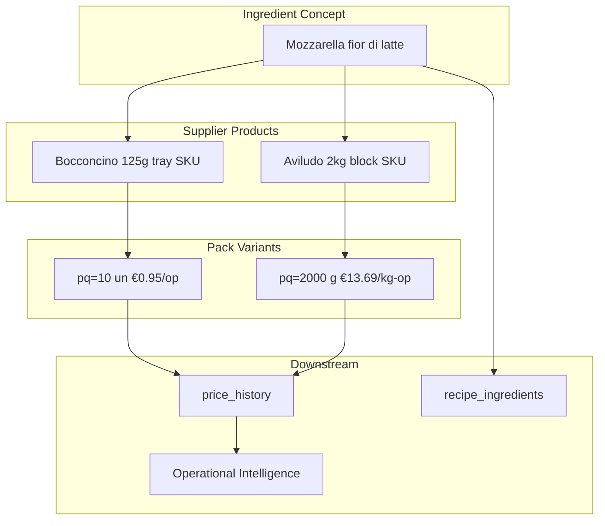

# Ingredient Identity — Future Architecture Design

**Generated:** 2026-06-13  
**Mode:** READ-ONLY architecture exercise — no code, SQL, deploy, or commit.

---

## Executive Summary

Marginly's proven VL failures (Mozzarella **+1341%**, Pepino **−100%**, Ginger Beer **€575/L**) are **identity architecture failures**, not synthesis math bugs. The recommended north-star is **Option E: Ingredient Concept → Supplier Product → Pack Variant**, delivered in phases that land **Option D** first, then E extensions.

**Ship P0 (history chain guard) immediately.** Do not enable production Operational Intelligence until P0+P1 complete and VL audits green.

---

## VL Evidence Driving This Design

| Failure | Live OI impact | Root cause |
|---------|----------------|------------|
| Mozzarella piece vs 2kg block | €744/mo false opportunity; AVILUDO +1341% watch | Same `ingredient_id`, history chains across pack formats |
| Pepino fresco vs conserva | −100% false decrease opportunity | Form-blind match; fresh kg → conserva catalog |
| Ginger Beer `0.20cl` | €575/L latent | No SKU/volume variant; parse ambiguity |
| 14/20 ghost history rows | Stale supplier movement counts | Prior extractions on collapsed IDs |

Sources: `.tmp/ingredient-identity-architecture-audit/`, `.tmp/historical-pricing-integrity-audit/`, `.tmp/operational-intelligence-integrity-audit/`, `.tmp/validation-lab-closure-audit/`

---

## Options Evaluated (1–5 scale)

| Option | Correctness | Complexity↑ | Migration↑ | Recipes | Opportunities | Supplier Intel | Scalability | **Total** |
|--------|-------------|-------------|------------|---------|---------------|----------------|-------------|-----------|
| **A** Status quo | 1 | 5 | 5 | 5 | 1 | 1 | 1 | **2.0** |
| **B** + Pack Variant | 4 | 4 | 3 | 4 | 4 | 3 | 3 | **3.6** |
| **C** + Supplier Product | 3 | 3 | 3 | 4 | 3 | 4 | 3 | **3.3** |
| **D** + Supplier Product + Variant | 5 | 3 | 2 | 4 | 5 | 5 | 4 | **4.0** |
| **E** Concept + Product + Variant + Equivalence | 5 | 2 | 1 | 5 | 5 | 5 | 5 | **4.1** |

↑ Higher = simpler / cheaper

**A is disqualified.** **E is recommended** with pragmatic delivery via **P0 → B → D → E**.

---

## Recommended Architecture (Option E)

### Three layers

```
ingredient_concept          ← recipes, prep leaves, menu ontology
    └── supplier_product    ← commercial SKU per supplier
            └── pack_variant ← purchase contract (pq, base_unit, price)
                    └── price_history (chain only within variant)
```

### Optional E extensions (Phase 3)

- **equivalence_groups** — recipe substitution without false price deltas
- **form_dimension** — fresh / preserved / beverage guards
- **forecasting_series** — time series per `pack_variant_id`

### Core rules

1. **price_history** keys on `pack_variant_id` — never chain across variants
2. **Aliases** resolve to `supplier_product_id` or `pack_variant_id` with contract snapshot
3. **Recipes** bind to `ingredient_concept_id` + optional `pack_variant_id` override
4. **sub_recipe_id** graph unchanged — prep costing rolls up from leaf variant prices
5. **Supplier intelligence** aggregates at product and variant; compares only equivalent variants

---

## How E Solves VL Failures

### Mozzarella (Bocconcino piece vs Aviludo 2kg)

| Today | Future |
|-------|--------|
| One ID `2a99cecd` | One concept, two supplier_products, two pack_variants |
| History: €0.95 → €13.69 (+1341%) | History chains only within variant (piece or block) |
| OI: €744/mo false savings | Real movement only when same variant repriced |

### Pepino (fresco vs conserva)

| Today | Future |
|-------|--------|
| "Pepino conserva" absorbs fresh kg | **Split concepts** (recommended) or form guard blocking match |
| −99.95% false deflation | No cross-form history chain |

### Ginger Beer (`0.20cl`)

| Today | Future |
|-------|--------|
| 2 ml/bottle → €575/L | `pack_variant.volume_ml_per_unit = 200` (20cl) |
| Unmatched line | Supplier product + variant created at match; extraction guard rejects implausible ml |

### Alias contamination

| Today | Future |
|-------|--------|
| `alias → ingredient_id` | `alias → pack_variant_id` + `contract_hash` at confirm |
| Cross-supplier wording locks wrong economics | New variant suggested when contract differs |

---

## Impact on Recipes & Prep

| Area | Impact |
|------|--------|
| **Recipe lines** | `recipe_ingredients.ingredient_id` becomes concept; optional `pack_variant_id` |
| **Default costing** | Uses `concept.default_pack_variant_id` — backfill preserves today's costs |
| **Sub-recipes** | `sub_recipe_id` XOR unchanged; prep batches remain `recipes(id)` |
| **Cascading cost** | `recipe-merge` walk unchanged; leaf resolver reads variant price |
| **UX** | Simple mode: concept only; advanced: pick variant per line |

**Recipe costing before identity:** Safe for **single-format pilot**; **not safe at production scale** when multiple suppliers/formats hit same concept (VL Mozzarella proves catalog `current_price` last-write-wins).

---

## Impact on Operational Intelligence

| Feature | Today | After E |
|---------|-------|---------|
| Opportunities | False ±100% from collapsed IDs | Variant-scoped; `format_change` vs `price_spike` |
| Supplier watch | AVILUDO +1341% Mozzarella | Per-product notes; equivalence-gated |
| Historical pricing | PARTIAL (math OK, inputs bad) | CLOSED when P1+P2 complete |
| Forecasting | Not viable | `pack_variant_id` time series |

---

## Migration Strategy (conceptual)

| Phase | What | No SQL — design only |
|-------|------|----------------------|
| **P0** | History chain guard, OI `format_change` flag | 1–2 weeks |
| **P1** | Pack variants, variant-scoped history, invoice match | 2–3 weeks |
| **P2** | Supplier products, alias hardening, per-product intel | 2 weeks |
| **P3** | Equivalence groups, form ontology, recipe variant picker | 2 weeks |
| **P4** | OI production enablement, VL re-read, deprecate dual-write | 1–2 weeks |

See `migration-strategy.json` for VL case plans (Mozzarella, Pepino, Ginger Beer).

---

## Implementation Roadmap

See `implementation-roadmap.json` for sprint-level deliverables and success criteria.

**Build next (ordered):**
1. P0 cross-format history guard
2. P1 pack_variants schema + matching
3. VL re-read (parallel)
4. P2 supplier_products
5. Ginger Beer volume parse
6. P3 equivalence_groups
7. P4 OI launch + dashboard wire

---

## Final Questions

### 1. Is Ingredient Identity the highest-leverage remaining foundation problem?

**YES (83% confidence).**

Extraction is mostly closed (83%). OI math is sound but outputs are poisoned. Identity collapse causes €744/mo false opportunities and +1341% supplier alerts. Stale DB is high-leverage operationally but does not fix structural collapse.

### 2. Can recipe costing be safely built before new identity architecture?

**Partially (78% confidence).**

- **Yes** for single-format catalogs with manual hygiene
- **No** for multi-supplier production — Mozzarella proves `current_price` corruption
- Sub-recipe graph is already sound; leaf pricing needs variant layer

### 3. Minimum identity improvements before Historical Pricing / Opportunities / Supplier Intelligence?

**P0 + P1 minimum; P2 for full supplier intelligence (86% confidence).**

| Enable | Requires |
|--------|----------|
| Historical pricing (trusted) | P0 guard + P1 variants + VL re-read |
| Opportunities | P0 + P1; suppress multi-format concepts |
| Supplier intelligence (full) | P0 + P1 + P2 supplier products |
| Ginger Beer beverages | Volume parse + variant with `volume_ml_per_unit` |

### 4. What should be built NEXT?

**P0 history chain guard**, then **P1 pack variants** (88% confidence).

Parallel: VL re-read, Ginger Beer parse, hide/wire mock home dashboard.

---

## Artifacts

| File | Contents |
|------|----------|
| `architecture-options.json` | Options A–E scored + target entity model |
| `migration-strategy.json` | Phased conceptual migration (no SQL) |
| `implementation-roadmap.json` | Sprint roadmap P0–P4 |
| `executive-summary.json` | Final question answers + confidence |
| `REPORT.md` | This document |

---

## Architecture Diagram



**Chain rule:** `previous_price` links only between rows sharing the same `pack_variant_id`.
