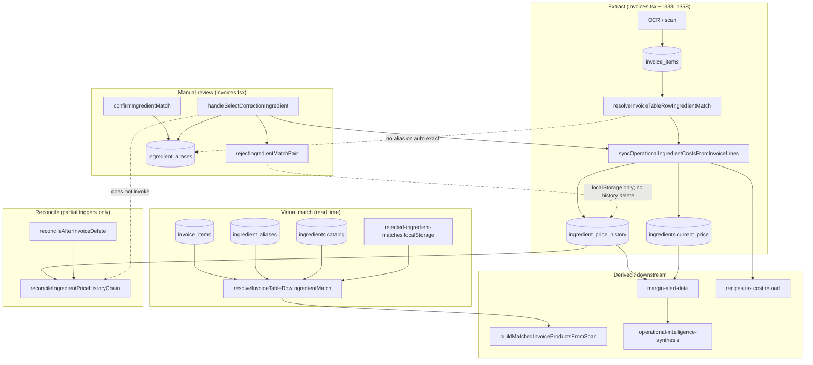

# Match Lifecycle — Current Architecture Map

**Mode:** READ-ONLY · **Generated:** 2026-06-14  
**Scope:** Ingredient matching lifecycle foundations (facts only)

---

## Characterization

Match assignment is implemented as **three decoupled writes** with **no binding lifecycle record**:

1. **Line fact** — `invoice_items` (text, qty, price; no `ingredient_id`)
2. **Confirmation memory** — `ingredient_aliases` (optional; manual confirm/correct only)
3. **Cost projection** — `ingredient_price_history` + `ingredients.current_price` (automatic on extract for matched **and** suggested)

The **effective match** is a **runtime projection** via `resolveInvoiceTableRowIngredientMatch`. Cost side-effects are written eagerly at extract; correction is forward-only.

---

## High-Level Architecture



---

## State Model (Actual Behavior)

There is **no persisted match lifecycle state machine**. Observed states are runtime/UI only.

| State | Trigger | Persisted at extract | Alias written | Cost sync |
|-------|---------|---------------------|---------------|-----------|
| **Unmatched** | Matcher null / `displayState: unmatched` | `invoice_items` only | No | **Skipped** |
| **Suggested** | `kind` ∈ {semantic, operational-equivalent} | History + `current_price` | No (until Confirm) | **Yes** |
| **Confirmed** | `kind` ∈ {exact, confirmed-alias, operational-memory, …} | History + `current_price` | Only if prior alias | **Yes** |

**Evidence:** `ingredient-operational-intelligence.ts:933` skips only `unmatched` bucket; suggested and confirmed both sync.

---

## Transitions (Actual)

### Suggested → Confirmed (user Confirm)

```
confirmIngredientMatch (invoices.tsx ~1882)
  → persistIngredientCorrectionForItem
      → upsertConfirmedAlias
      → persistOperationalIngredientCostFromInvoiceLine
      → dispatchOperationalIngredientCostChanged
```

Adds alias + optional history refresh. Removes nothing from prior wrong assignment.

### Confirmed/Suggested → Corrected (different ingredient)

```
handleSelectCorrectionIngredient (invoices.tsx ~2944)
  → rejectIngredientMatchPair (localStorage)
  → persistIngredientCorrectionForItem (new target)
```

| Layer | Old target | New target |
|-------|-----------|------------|
| Virtual match | Blocked via reject pair | Alias UPSERT |
| `ingredient_aliases` | Unchanged (unless existed) | UPSERT → new id |
| `ingredient_price_history` | **Orphan row remains** | INSERT/UPDATE |
| `ingredients.current_price` | **Not reverted** | Updated |
| Reconcile chain | **Not invoked** | — |

### Any → Unmatched

**Not supported in production.** `rejectIngredientMatchSuggestion` exists but has zero route callers. No history DELETE, no price revert.

### History rebuild triggers

| Trigger | Service | Invoked? |
|---------|---------|----------|
| Re-extract UPDATE same `(invoice_id, ingredient_id)` | `reconcileIngredientPriceHistoryChain` | Yes |
| Delete entire invoice | `reconcileAfterInvoiceDelete` | Yes |
| Match correction | — | **No** |
| Unmatch | — | **No handler** |

---

## Pepino Reference Case (Observed)

| Artifact | After auto-match (pre-review) | After correction | After unmatch (hypothetical) |
|----------|------------------------------|------------------|------------------------------|
| `invoice_items` | Pepino line | unchanged | unchanged |
| Virtual match | → Pepino conserva (`635a1189`) | → new id (reject pair) | null |
| `ingredient_aliases` (Pepino) | none | UPSERT → new | none |
| History `a689bd91` | on conserva | **still on conserva** | would need delete |
| `635a1189` `current_price` | poisoned/overwritten | **not reverted** | would need revert |

Sources: `.tmp/pepino-contamination-timeline/`, `.tmp/match-correction-reversal-audit/`

---

## Missing Lifecycle Artifacts (Not Present Today)

- Persisted match status per `invoice_item` (`ingredient_id`, `match_status`, `confirmed_at`)
- `invoice_item_id` FK on `ingredient_price_history`
- Match correction audit log
- Server-side rejected-pair store
- Unmatch tombstone record
- Production Unmatch UI/handler

---

## Prior Audit Cross-References

| Audit | Path |
|-------|------|
| Pepino contamination timeline | `.tmp/pepino-contamination-timeline/REPORT.md` |
| Match correction reversal | `.tmp/match-correction-reversal-audit/REPORT.md` |
| Match lifecycle architecture | `.tmp/match-lifecycle-architecture-audit/` |
| Remove match investigation | `.tmp/remove-match-investigation/REPORT.md` |
| Identity contamination | `.tmp/identity-contamination-audit/REPORT.md` |
