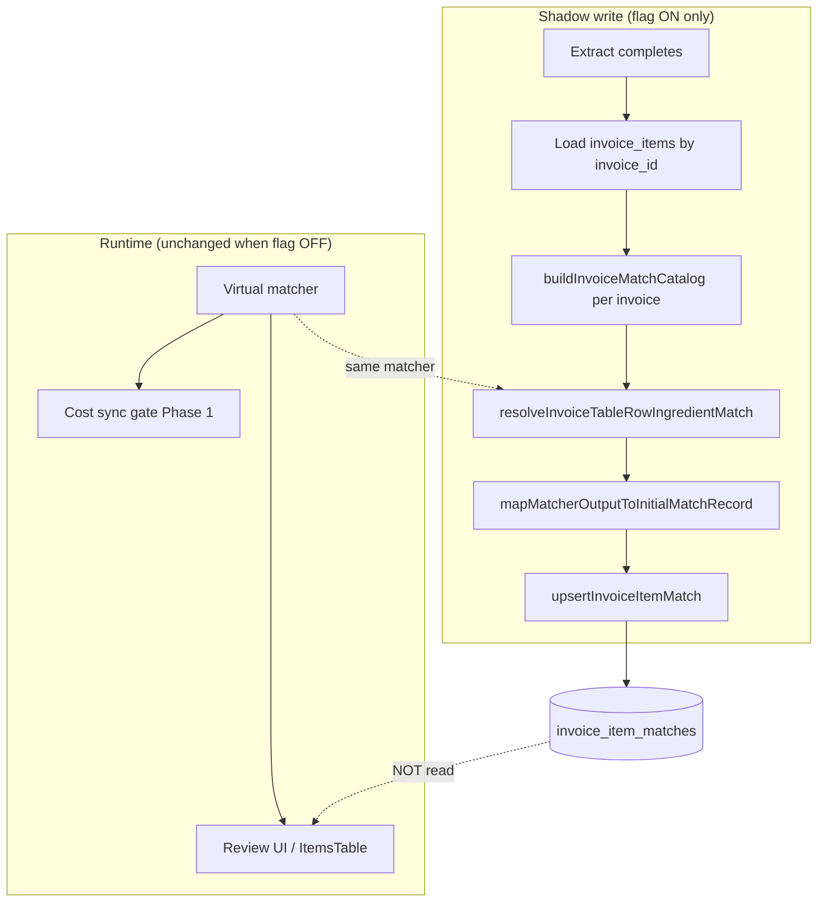

# Shadow Population Flow — Phase 2

## Architecture (shadow mode)

## Classification (persisted status)

| Matcher outcome | `match_kind` examples | Persisted `status` |
|-------------------|----------------------|-------------------|
| No match | — | `unmatched` |
| Alias-backed | `confirmed-alias`, `confirmed-override` | `confirmed` + `confirmed_at` |
| All other hits | `exact`, `semantic`, `operational-memory`, `operational-equivalent`, … | `suggested` |

**Pepino fix:** bare `exact` / `operational-memory` without alias → `suggested`, not `confirmed` (differs from legacy `displayState` for `exact`).

## Extract path sequence

1. OCR extract normalizes items
2. Delete + insert `invoice_items` (unchanged)
3. `syncOperationalIngredientCostsFromInvoiceLines` (Phase 1 gate — unchanged)
4. **If `VITE_MATCH_LIFECYCLE_SHADOW_SEED` enabled:**
   - Select `id, name` for inserted invoice
   - `shadowSeedInvoiceItemMatchesAfterExtract` → upsert per line
5. Return extract result (unchanged)

Failures in step 4 are logged; extract success is not rolled back.

## Match catalog scope

Per invoice, `buildInvoiceMatchCatalog(catalog, allLineNamesOnInvoice)` — matches ItemsTable / VL investigation behavior (not single-line isolation).

## Flag reference

| Variable | Default | Effect |
|----------|---------|--------|
| `VITE_MATCH_LIFECYCLE_SHADOW_SEED` | OFF | Enables extract shadow upserts |
| `VITE_MATCH_LIFECYCLE_EXTRACT_GATE` | ON | Unrelated to shadow; Phase 1 cost gate |
| `VITE_MATCH_LIFECYCLE_ALIAS_AUTO_CONFIRM` | ON | Unrelated to shadow seed classification |
