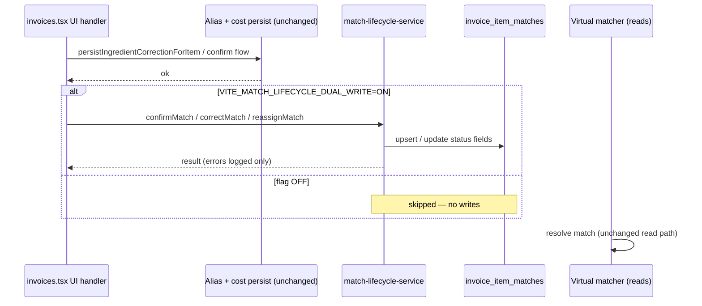

# Phase 3 — Dual Write Flow

## Architecture

## Per-action flow

### Confirm suggested match (T3)

1. User clicks Confirm → `confirmIngredientMatch`
2. `persistIngredientCorrectionForItem` — alias upsert + operational cost sync (**unchanged**)
3. On success → `confirmMatch` — `status=confirmed`, `confirmed_at=now`, preserve `match_kind` from matcher
4. `dispatchOperationalIngredientCostChanged` — **unchanged**

### Manual ingredient pick (unmatched → confirmed)

1. User selects ingredient → `selectIngredientForItem`
2. `persistIngredientCorrectionForItem` — **unchanged**
3. On success → `confirmMatch` with `match_kind=manual`

### Correction / reassign (T6/T7)

1. User opens correction picker → snapshot stores `previousIngredientId` + `wasConfirmed`
2. User selects new ingredient → `handleSelectCorrectionIngredient`
3. `rejectIngredientMatchPair` — **unchanged**
4. `onSelectIngredientForItem` → `selectIngredientForItem` → `persistIngredientCorrectionForItem` — **unchanged**
5. On success → dual-write via lifecycle options:
   - `wasConfirmed=true` → `reassignMatch` (confirmed stays confirmed)
   - `wasConfirmed=false` → `correctMatch` with `keepConfirmed=false` (stays suggested)

### Canonical create (manual assignment)

1. `saveCanonicalIngredientFromInvoice` / bulk create succeeds
2. `confirmMatch` with `match_kind=manual` — additive only

## Error handling

Dual-write failures are **logged to console** and do not roll back alias/cost persist or affect UI toasts. Phase 3 treats lifecycle records as shadow authority being built toward Phase 4 cutover.

## Flag interaction

| Flag | Phase | Interaction |
|------|-------|-------------|
| `VITE_MATCH_LIFECYCLE_SHADOW_SEED` | 2 | Extract-time seed; independent of dual-write |
| `VITE_MATCH_LIFECYCLE_DUAL_WRITE` | 3 | User-action lifecycle updates only |

Both can be enabled together: extract seeds initial rows; user actions update them.
