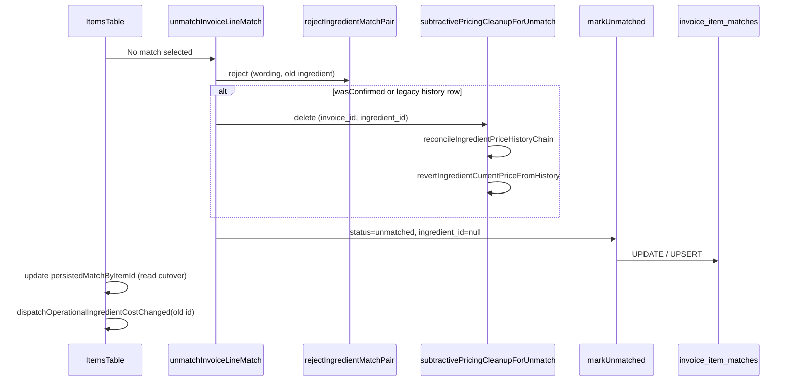

# Phase 5 — Unmatch Flow

**Generated:** 2026-06-14 · **Verdict context:** Match Lifecycle V1 Phase 5

## UI Entry

`InvoiceIngredientCorrectionPicker` now exposes an **Actions** group:

| Option | Handler |
|--------|---------|
| **No match** | `handleRemoveCorrectionMatch` → `onUnmatchInvoiceLine` |
| **Create ingredient** | `onCreateIngredient` (moved into picker; inline button retained for unmatched rows) |
| Existing ingredients | `handleSelectCorrectionIngredient` (unchanged) |

**Files:** `src/components/invoice-ingredient-correction-picker.tsx`, `src/routes/invoices.tsx` (`ItemsTable`)

## Server Flow (T4/T5)



## Lifecycle Write Policy

| Transition | Dual-write flag | Behavior |
|------------|-----------------|----------|
| Confirm / correct / reassign | `VITE_MATCH_LIFECYCLE_DUAL_WRITE` | Gated (Phase 3) |
| **Unmatch** | **Not gated** | **Always persists** to `invoice_item_matches` |

Rationale: read cutover (`VITE_MATCH_LIFECYCLE_READ_CUTOVER`) requires tombstone writes on Remove Match.

## Read Cutover

After successful unmatch, `persistedMatchByItemId` is updated in-memory:

```ts
{ ingredient_id: null, status: "unmatched", match_kind: null }
```

`resolveInvoiceTableRowIngredientMatch` → `displayState: "unmatched"` (existing Phase 4B mapping).

## Key Modules

| Module | Role |
|--------|------|
| `match-lifecycle-unmatch.ts` | Orchestrator |
| `match-lifecycle-unmatch-pricing.ts` | T5 subtractive cleanup |
| `match-lifecycle-service.ts` | `markUnmatched` (always writes) |
| `ingredient-correction-memory.ts` | `rejectIngredientMatchPair` |
