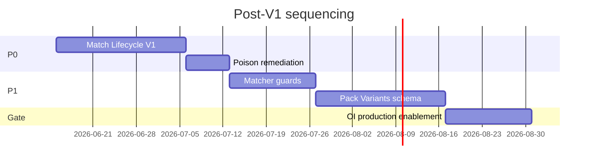

# Match Lifecycle V1 — Final Recommendation

**Mode:** READ-ONLY architecture design · **Generated:** 2026-06-14  
**Constraint:** Architecture recommendation only. No implementation plan, DDL, or code changes.

---

## Recommendation (One Sentence)

**Ship Option B: a persisted per-line match record (`invoice_item_matches`) with three statuses, gated hybrid pricing, and subtractive correction/unmatch — before Pack Variants P1.**

Confidence: **91%** — consistent across pepino timeline, correction-reversal, foundations, remove-match, and identity contamination audits.

---

## Problem Recap (Established Facts)

| Fact | Evidence |
|------|----------|
| Contamination occurs **before review** | Pepino history `a689bd91` at extract 2026-06-09, zero user action (`.tmp/pepino-contamination-timeline/REPORT.md`) |
| Match correction does **not** fully reverse | Verdict code 2 — orphan history, no current_price revert (`.tmp/match-correction-reversal-audit/`) |
| No production **Unmatch** workflow | `rejectIngredientMatchSuggestion` zero callers (`.tmp/remove-match-investigation/`) |
| No persisted per-line match SoT | Foundations verdict (`.tmp/match-lifecycle-foundations-audit/FINAL_VERDICT.md`) |
| Cost side-effects persisted **independently** from match state | Three decoupled writes (`.tmp/match-lifecycle-design-investigation/CURRENT_ARCHITECTURE.md`) |
| Match Lifecycle **partial** (code 2) | `.tmp/match-lifecycle-architecture-audit/FINAL_VERDICT.md` |
| Pack Variants **necessary but insufficient alone** | `pack_variants_without_workflow_fix.safe: false` |

---

## Smallest Architecture That Closes the Pepino Lifecycle Problem

### 1. State machine — three statuses only

`unmatched` | `suggested` | `confirmed`

- Drop **Corrected** and **Reassigned** as persisted states — they are transitions
- See `LIFECYCLE_STATE_MACHINE.md`

### 2. Source of truth — one new entity

**Primary:** `invoice_item_matches` (one row per `invoice_item_id`)

- Binds: ingredient (nullable), status, match_kind, timestamps, previous_ingredient_id
- Nullable `pack_variant_id` for P1 — no lifecycle rewrite later
- See `SOURCE_OF_TRUTH_DESIGN.md`

### 3. Transitions — gated writes + subtractive cleanup

| Transition | Cost side-effects |
|------------|-------------------|
| → suggested | **None** |
| → confirmed | Append history + reconcile |
| correct / reassign | DELETE old row + reconcile both targets |
| → unmatched | DELETE row + reconcile |

- See `LIFECYCLE_TRANSITIONS.md`

### 4. Pricing — hybrid materialized projection

- **Authority:** confirmed match records + line facts
- **Storage:** retain `ingredient_price_history` + `current_price` as materialized caches
- **Not:** eager extract sync; not fully derived event replay (V1)
- See `PRICING_OWNERSHIP.md`

### 5. Auto-confirm policy — conservative default

- All first-time matcher hits → `suggested` at extract
- Optional fast path: `confirmed` only when alias exists for wording
- **Never** auto-confirm bare-word `exact` without alias (Pepino root cause)

### 6. UI — three actions map 1:1 to transitions

| User action | Transition |
|-------------|------------|
| Confirm match | suggested → confirmed |
| Correct match | confirmed → confirmed (new target) + subtractive |
| Remove match | * → unmatched + subtractive |

---

## Pack Variant Compatibility

- Lifecycle attaches to **`invoice_item_matches`**
- Pricing attaches to **`pack_variant_id`** at P1 (column nullable in V1)
- Recipes attach to **`ingredient_concept`** with default variant costing

**Sequence:** Lifecycle gate in production **before** any P1 cost sync to variants.

See `PACK_VARIANT_INTEGRATION.md`.

---

## Migration — Option B

| Phase | Action |
|-------|--------|
| Schema | Add `invoice_item_matches` with nullable `pack_variant_id` |
| Seed | Classify existing lines (40 unmatched, 4 suggested, 7 confirmed, 11 remediate) |
| Remediate | DELETE Pepino `a689bd91`, Mozzarella orphans; reconcile chains |
| Cutover | Match record = read/write authority; gate extract sync |
| Promote | localStorage reject → server log |

Option A (gate only) acceptable as **fast follow** but insufficient alone. Option C deferred.

See `MIGRATION_OPTIONS.md`.

---

## What NOT to Do

| Anti-pattern | Why |
|--------------|-----|
| Pack Variants P1 alone | Does not gate pre-review sync |
| P0 read guard as primary fix | Bandage only — does not stop extract writes |
| Virtual match + server reject only (Option 4) | Pepino had no alias; exact bypasses confirm |
| Gate-only as final architecture (Option A alone) | Reassignment orphans without line SoT |
| Simultaneous lifecycle + full Option E cutover | Scope creep |

---

## Marginly Principles — Preserved

| Principle | How V1 delivers |
|-----------|-----------------|
| **Simple UX** | Confirm / Correct / Remove Match = three transitions |
| **No ERP complexity** | One match table + gated projection — not event store |
| **Human review when needed** | Suggested does not sync cost |
| **Reliable historical pricing** | History keyed through match; orphan cleanup on reversal |
| **Reliable operational intelligence** | OI reads confirmed-cost inputs; guard = safety net |

---

## Reuse (Existing Services)

| Service | V1 role |
|---------|---------|
| `resolveInvoiceTableRowIngredientMatch` | Propose assignment at extract |
| `syncOperationalIngredientCostsFromInvoiceLines` | **Gated** — confirm/correct only |
| `appendIngredientPriceHistoryFromInvoiceLine` | On confirmed transitions |
| `reconcileIngredientPriceHistoryChain` | After append/delete + correction |
| `backfillIngredientPriceHistoryFromInvoices` | Admin rebuild — confirmed only |
| `persistManualIngredientCorrection` / alias upsert | On confirm/correct |
| `dispatchOperationalIngredientCostChanged` | Both old + new id on correction |

## Demote / Retire

- Extract-time cost sync for unconfirmed matches
- Virtual match as implicit SoT
- Client-only reject blocklist as primary authority
- Unwired `rejectIngredientMatchSuggestion` (wire to Remove Match)

---

## Sequencing After V1

| Order | Workstream |
|-------|------------|
| 1 | Match lifecycle V1 (this design) |
| 2 | Remediation + VL re-read |
| 3 | Matcher guards (preservation class, token-subset) |
| 4 | Pack Variants P1 |
| 5 | Supplier product layer (P2) |
| 6 | OI production enablement |

---

## Success Criteria (Architecture-Level)

| Criterion | Measurement |
|-----------|-------------|
| Pre-review poison stopped | No history row without `status=confirmed` match record |
| Pepino class reversible | Remove Match deletes `a689bd91` equivalent; reconcile conserva |
| Correction subtractive | Old-target history deleted; both ids rechained |
| Per-line attribution | Match record authoritative; no dual invoice rows per line |
| OI inputs trustworthy | Confirmed-only history; P0 guard rarely fires |
| P1 ready | `pack_variant_id` column exists; lifecycle semantics unchanged |

---

## Deliverable Index

| File | Contents |
|------|----------|
| `LIFECYCLE_STATE_MACHINE.md` | Three-status model; alternatives challenged |
| `SOURCE_OF_TRUTH_DESIGN.md` | Entity classification; match record as primary SoT |
| `LIFECYCLE_TRANSITIONS.md` | Per-transition behavior and side effects |
| `PRICING_OWNERSHIP.md` | Hybrid materialized pricing; tradeoffs |
| `PACK_VARIANT_INTEGRATION.md` | Attachment points; lifecycle-first sequencing |
| `MIGRATION_OPTIONS.md` | Options A/B/C comparison |
| `FINAL_RECOMMENDATION.md` | This document |

---

## Evidence Cross-References (Complete)

| Audit | Path |
|-------|------|
| Design investigation | `.tmp/match-lifecycle-design-investigation/` |
| Foundations audit | `.tmp/match-lifecycle-foundations-audit/` |
| Architecture audit | `.tmp/match-lifecycle-architecture-audit/` |
| Pepino timeline | `.tmp/pepino-contamination-timeline/` |
| Correction reversal | `.tmp/match-correction-reversal-audit/` |
| Remove match | `.tmp/remove-match-investigation/` |
| Identity contamination | `.tmp/identity-contamination-audit/` |
| Identity future design | `.tmp/ingredient-identity-future-design/` |
| Key source | `src/lib/ingredient-operational-intelligence.ts` (sync gate ~933) |
| Key source | `src/lib/ingredient-price-history-reconcile.ts` (reconcile ~124) |
| Key source | `src/lib/ingredient-correction-memory.ts` (alias/reject) |
