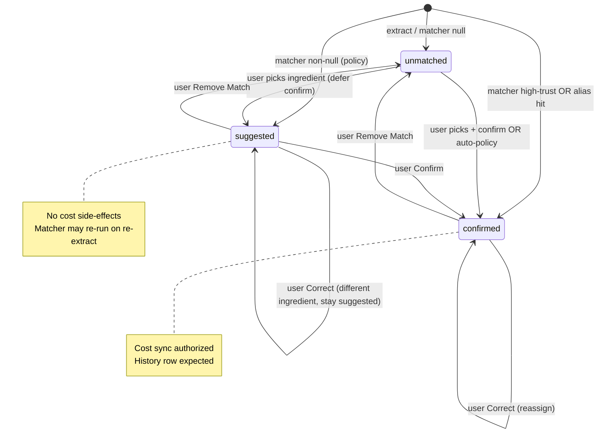

# Match Lifecycle V1 — State Machine Design

**Mode:** READ-ONLY architecture design · **Generated:** 2026-06-14  
**Evidence base:** `.tmp/match-lifecycle-design-investigation/`, `.tmp/match-lifecycle-foundations-audit/`, `.tmp/match-lifecycle-architecture-audit/`, `.tmp/pepino-contamination-timeline/`, `.tmp/match-correction-reversal-audit/`

---

## Problem Statement

Today there is **no persisted match lifecycle state machine**. Observed states (Suggested, Confirmed, Unmatched) are **runtime/UI distinctions only** — both suggested and confirmed sync cost at extract (`.tmp/match-lifecycle-architecture-audit/MATCH_LIFECYCLE_MAP.md`). Correction and reassignment are **forward-only additive writes** with no subtractive semantics (verdict code 2, `.tmp/match-correction-reversal-audit/verdict.json`).

The Pepino case proves the gap: `kind: exact` → `displayState: confirmed` at extract with **no alias**, history row `a689bd91` written before any human review (`.tmp/pepino-contamination-timeline/REPORT.md`).

---

## Design Question: Do We Need All Five Labels?

| Label | Persisted state or transition? | Verdict |
|-------|-------------------------------|---------|
| **Suggested** | State | **Yes** — gates cost projection |
| **Confirmed** | State | **Yes** — authorizes cost side-effects |
| **Unmatched** | State | **Yes** — explicit tombstone; enables Remove Match |
| **Corrected** | Transition event | **No** — not a distinct status |
| **Reassigned** | Transition event | **No** — same as correction with different target |

**Corrected** and **Reassigned** describe *what happened*, not *where the line sits now*. After correction, the line is either `confirmed` (new ingredient assigned) or `unmatched` (if user removes match). Storing "corrected" as a status adds ERP complexity without changing behavior.

### Alternative A — Three persisted statuses (recommended)

```
unmatched | suggested | confirmed
```

- `ingredient_id`: nullable (null when unmatched)
- Audit trail via `previous_ingredient_id`, `confirmed_at`, `updated_at`, optional `transition_reason`

### Alternative B — Two statuses + confirmation timestamp

```
unmatched | assigned
```

- `assigned` + `confirmed_at IS NULL` → behaves as suggested
- `assigned` + `confirmed_at IS NOT NULL` → behaves as confirmed

**Tradeoff:** Simpler enum, but splits one concept across two columns. Harder to query "all lines awaiting review." Marginly UX maps cleanly to three labels users already see.

### Alternative C — Event-sourced statuses

Append-only events: `suggested`, `confirmed`, `corrected`, `unmatched`, `reassigned`.

**Tradeoff:** Maximum auditability; high complexity. Over-engineered for Marginly principles (`.tmp/match-lifecycle-design-investigation/TARGET_LIFECYCLE_OPTIONS.md` Option 3 verdict).

### Alternative D — Virtual match only (status quo + gate)

No persisted status; gate cost sync on matcher `displayState`.

**Tradeoff:** Insufficient — Pepino had `displayState: confirmed` from auto `exact` with no alias (`.tmp/remove-match-investigation/REPORT.md`). Cannot distinguish "user confirmed" from "matcher promoted."

---

## Recommended V1 State Machine

**Three persisted statuses** on `invoice_item_matches` (conceptual table):

| Status | `ingredient_id` | Cost sync allowed | Alias write allowed | UI |
|--------|-----------------|-------------------|---------------------|-----|
| `unmatched` | NULL | No | No (tombstone) | Picker open; Create new |
| `suggested` | non-NULL | **No** | No | Confirm + Correct |
| `confirmed` | non-NULL | **Yes** | Yes (on confirm/correct) | Matched chip; Correct / Remove |

### State diagram



### Auto-confirm policy (extract behavior change)

Today: `kind: exact` → UI confirmed + extract sync (Pepino root cause).

V1 policy options (pick one at implementation):

| Policy | Extract status | Rationale |
|--------|---------------|-----------|
| **Conservative (recommended)** | All non-null matcher → `suggested` | Human review for every first-time link; stops Pepino class |
| **Alias-only auto-confirm** | `confirmed` only if alias hit | Preserves fast path for repeat wording |
| **Trust-tier auto-confirm** | `confirmed` for `confirmed-alias` only | Middle ground |

Evidence supports **Conservative** or **Alias-only** — bare-word `exact` without alias must not auto-confirm (`.tmp/pepino-contamination-timeline/REPORT.md`).

---

## What Is NOT a State

| Concept | V1 treatment |
|---------|--------------|
| **Corrected** | Transition: `confirmed → confirmed` with `previous_ingredient_id` update + subtractive cleanup |
| **Reassigned** | Same transition; semantic difference is UI copy only |
| **Rejected pair** | Matcher input (blocklist), not lifecycle status — promote to server-side reject log |
| **Virtual match** | Read-time projection from match record + aliases + reject log — **not SoT** |
| **displayState** | UI projection derived from `status` + `match_kind` |

---

## Match Kind (metadata, not status)

Persist `match_kind` on the match record as **assignment provenance**, not as a lifecycle state:

- `exact`, `semantic`, `confirmed-alias`, `operational-equivalent`, `manual`, etc.
- Used for UI explanation (`ingredient-match-explanation.ts` patterns)
- Used for auto-confirm policy decisions at extract
- Does **not** authorize cost sync — only `status=confirmed` does

---

## Comparison to Current Runtime States

| Current (runtime) | V1 persisted | Change |
|-------------------|--------------|--------|
| Unmatched | `unmatched` | Explicit record (not absence of data) |
| Suggested | `suggested` | **Cost sync blocked** |
| Confirmed (auto exact) | `suggested` or `confirmed` per policy | **Gate breaks Pepino path** |
| Confirmed (alias) | `confirmed` | Same, with alias-derived fast path |
| Correction | Transition, not status | **Subtractive cleanup added** |
| Unmatch | `unmatched` | **New production path** |

---

## Minimum Viable vs Full Lifecycle

**Minimum viable (closes Pepino + reversal gap):**

1. Persisted record with 3 statuses
2. Cost sync gated on `confirmed` only
3. Subtractive cleanup on correct/unmatch
4. Remove Match UI

**Explicitly deferred (not required for V1 states):**

- Full event log / audit table
- Separate `corrected` status
- Cross-device reject sync (can ship with match record tombstone)
- `pack_variant_id` on match record (nullable column OK; P1 fills it)

---

## Evidence Cross-References

| Finding | Source |
|---------|--------|
| No persisted lifecycle record | `.tmp/match-lifecycle-foundations-audit/FINAL_VERDICT.md` |
| Partial lifecycle verdict code 2 | `.tmp/match-lifecycle-architecture-audit/FINAL_VERDICT.md` |
| Suggested + confirmed both sync at extract | `ingredient-operational-intelligence.ts:933`; `.tmp/match-lifecycle-architecture-audit/MATCH_LIFECYCLE_MAP.md` |
| Pepino pre-review contamination | `.tmp/pepino-contamination-timeline/REPORT.md` |
| Correction does not revert | `.tmp/match-correction-reversal-audit/REPORT.md` |
| No production unmatch | `.tmp/remove-match-investigation/REPORT.md` |
