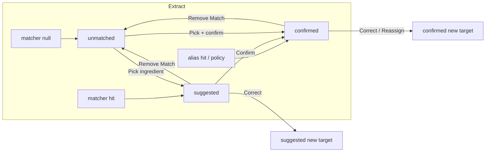

# Match Lifecycle V1 — Transition Specifications

**Mode:** READ-ONLY architecture design · **Generated:** 2026-06-14  
**Evidence base:** `.tmp/match-correction-reversal-audit/`, `.tmp/remove-match-investigation/`, `.tmp/pepino-contamination-timeline/`, `.tmp/match-lifecycle-architecture-audit/MATCH_LIFECYCLE_MAP.md`

---

## Transition Service (conceptual)

All lifecycle mutations flow through a single **Match Lifecycle Service** — not scattered across `invoices.tsx` handlers. Today correction is additive via `persistIngredientCorrectionForItem` with no subtractive path (`.tmp/match-correction-reversal-audit/REPORT.md`).

Each transition: **validate → update match record → side effects → invalidate projections**.

---

## Transition Matrix Overview

---

## T1: Extract → Suggested

**Trigger:** Matcher returns non-null; auto-confirm policy does **not** apply.

### Match record

| Field | Value |
|-------|-------|
| `status` | `suggested` |
| `ingredient_id` | matcher result |
| `match_kind` | from matcher |
| `confirmed_at` | NULL |

### Side effects

| Layer | Action |
|-------|--------|
| `invoice_items` | Insert/update line facts (unchanged) |
| `ingredient_price_history` | **None** |
| `ingredients.current_price` | **None** |
| `ingredient_aliases` | **None** |
| Reject log | **None** |
| Caches | Invalidate purchase scan for invoice |

### History implications

No audit row. Line awaits human Confirm.

### Fixes today

Suggested currently syncs cost at extract (`ingredient-operational-intelligence.ts:933` — skips only unmatched). **This transition blocks Pepino-class pre-review writes** when combined with conservative auto-confirm policy.

---

## T2: Extract → Confirmed (auto-confirm policy)

**Trigger:** Matcher hit + policy allows (e.g. existing alias for exact wording).

### Match record

| Field | Value |
|-------|-------|
| `status` | `confirmed` |
| `ingredient_id` | matcher result |
| `match_kind` | e.g. `confirmed-alias` |
| `confirmed_at` | extract timestamp |

### Side effects

| Layer | Action |
|-------|--------|
| `ingredient_price_history` | APPEND via `appendIngredientPriceHistoryFromInvoiceLine` |
| `ingredients.current_price` | UPDATE via `persistOperationalIngredientCostFromInvoiceLine` |
| `ingredient_aliases` | No new alias if alias already existed |
| Reconcile | `reconcileIngredientPriceHistoryChain(ingredient_id)` after append |
| Events | `dispatchOperationalIngredientCostChanged` |

### History implications

New history row keyed `(invoice_id, ingredient_id)`. Chain deltas computed by reconcile.

### Policy guard

**Do not** auto-confirm bare-word `exact` without alias — Pepino root cause (`.tmp/pepino-contamination-timeline/REPORT.md`).

---

## T3: Suggested → Confirmed (user Confirm)

**Trigger:** `confirmIngredientMatch` (today: `invoices.tsx ~1882`).

### Match record

| Field | Change |
|-------|--------|
| `status` | `suggested` → `confirmed` |
| `confirmed_at` | now |
| `ingredient_id` | unchanged unless user corrected in same action |

### Side effects

| Layer | Action |
|-------|--------|
| `ingredient_aliases` | UPSERT wording → ingredient (`upsertConfirmedAlias`) |
| `ingredient_price_history` | APPEND (first authorized write for this line) |
| `ingredients.current_price` | UPDATE |
| Reconcile | `reconcileIngredientPriceHistoryChain` |
| Events | cost-changed dispatch |
| Caches | clear matched products cache |

### History implications

First persisted cost fact for this line. Prior suggested state left **no** history — no cleanup needed.

### vs today

Today Confirm adds alias + may refresh history that **already existed from extract sync**. V1 Confirm is the **first** cost write.

---

## T4: Suggested → Unmatched (Remove Match)

**Trigger:** User Remove Match on suggested line.

### Match record

| Field | Change |
|-------|--------|
| `status` | `unmatched` |
| `ingredient_id` | NULL |
| `previous_ingredient_id` | prior suggestion |

### Side effects

| Layer | Action |
|-------|--------|
| `ingredient_price_history` | **None** (none should exist) |
| `ingredient_aliases` | **None** |
| Reject log | Optional: record `(wording, rejected_ingredient_id)` server-side |
| Matcher | Block re-suggestion via reject log |

### History implications

Tombstone only. No subtractive cleanup if gate worked.

### vs today

No production path (`.tmp/remove-match-investigation/REPORT.md`); `rejectIngredientMatchSuggestion` has zero callers.

---

## T5: Confirmed → Unmatched (Remove Match)

**Trigger:** User Remove Match on confirmed line.

### Match record

| Field | Change |
|-------|--------|
| `status` | `unmatched` |
| `ingredient_id` | NULL |
| `previous_ingredient_id` | prior confirmed ingredient |

### Side effects (subtractive — **critical**)

| Layer | Action |
|-------|--------|
| `ingredient_price_history` | **DELETE** row for `(invoice_id, ingredient_id)` attributable to this line |
| `ingredients.current_price` | **REVERT** via `reconcileIngredientPriceHistoryChain` → latest surviving history |
| `ingredient_aliases` | Policy: DELETE alias if this line was sole confirmer; else leave |
| Reject log | Record rejected pair |
| Reconcile | `reconcileIngredientPriceHistoryChain(old_ingredient_id)` |
| Events | cost-changed for **old** ingredient id |
| Caches | invalidate |

### History implications

Orphan row removed; delta chain on old ingredient repaired. Pepino scenario B (verdict code 3) **becomes supported**.

### vs today

Contamination fully persists on unmatch — no handler (`.tmp/match-correction-reversal-audit/REPORT.md` Scenario B).

---

## T6: Suggested → Suggested (Correct before confirm)

**Trigger:** User picks different ingredient while still suggested.

### Match record

| Field | Change |
|-------|--------|
| `status` | stays `suggested` |
| `ingredient_id` | new target |
| `previous_ingredient_id` | old suggestion |
| `match_kind` | `manual` or matcher re-run |

### Side effects

| Layer | Action |
|-------|--------|
| `ingredient_price_history` | **None** |
| Reject log | `rejectIngredientMatchPair(old)` — server-side |
| `ingredient_aliases` | **None** until confirm |

### History implications

No cost rows to clean. Reject log prevents re-suggestion of wrong target.

---

## T7: Confirmed → Confirmed (Correct / Reassign)

**Trigger:** `handleSelectCorrectionIngredient` (today: `invoices.tsx ~2944`).

### Match record

| Field | Change |
|-------|--------|
| `status` | stays `confirmed` |
| `ingredient_id` | new target |
| `previous_ingredient_id` | old target |
| `confirmed_at` | refresh or preserve original — **recommend refresh** |
| `match_kind` | `manual` |

### Side effects (subtractive + additive)

**Old target (subtractive):**

| Layer | Action |
|-------|--------|
| `ingredient_price_history` | **DELETE** `(invoice_id, old_ingredient_id)` row |
| Reconcile | `reconcileIngredientPriceHistoryChain(old_ingredient_id)` |
| Events | cost-changed for **old** id |

**New target (additive):**

| Layer | Action |
|-------|--------|
| `ingredient_aliases` | UPSERT wording → new ingredient |
| `ingredient_price_history` | APPEND for new target |
| `ingredients.current_price` | UPDATE new target |
| Reconcile | `reconcileIngredientPriceHistoryChain(new_ingredient_id)` |
| Reject log | block old pair |
| Events | cost-changed for new id |

### History implications

- Old orphan (e.g. Pepino `a689bd91`) **deleted**
- Old ingredient chain rechained without cross-format delta
- New ingredient receives attributable row
- **No dual `(invoice_id, *)` rows** for same line

### vs today (verdict code 2)

| Layer | Today | V1 |
|-------|-------|-----|
| Old history | **Orphan remains** | DELETE |
| Old current_price | **Not reverted** | Reconcile |
| Reconcile on correction | **Not invoked** | **Required** |
| cost-changed event | new id only | **both** ids |

Source: `.tmp/match-correction-reversal-audit/verdict.json`, `data-not-reverted.json`.

---

## T8: Confirmed → Confirmed (Reassign — same semantics as T7)

**Trigger:** User changes from ingredient A → ingredient B (same as correction).

Reassign is **not a separate transition** — identical side-effect contract as T7. UI may label "Reassigned" for clarity; persisted status remains `confirmed`.

### Reassign → Reassign (A → B → C)

Each hop runs full T7 subtractive + additive cycle:

1. DELETE history for `(invoice_id, B)` when leaving B
2. APPEND history for `(invoice_id, C)`
3. Reconcile B and C chains
4. Update `previous_ingredient_id` chain (V1: store immediate prior only; event log stores full chain if needed later)

---

## Re-extract Interaction

| Prior status | Re-extract behavior (recommended) |
|--------------|-----------------------------------|
| `unmatched` | Re-run matcher; update match record |
| `suggested` | Re-run matcher; update suggestion if not rejected |
| `confirmed` | **Preserve** match record; refresh line facts only; history refresh via existing UPDATE path + reconcile |
| `confirmed` + line text changed materially | Policy: downgrade to `suggested` OR flag for review — **do not silent overwrite** |

Today re-extract recreates `invoice_items` but preserves poisoned history (`a689bd91` — `.tmp/pepino-contamination-timeline/REPORT.md`).

---

## Idempotency Requirements

| Transition | Idempotency key |
|------------|-----------------|
| Confirm | `(invoice_item_id, status=confirmed)` — no double append |
| Correct | `(invoice_item_id, ingredient_id=new)` — delete old before append |
| Unmatch | `(invoice_item_id, status=unmatched)` — delete history once |
| Extract sync | `(invoice_item_id)` — upsert match record, no duplicate history |

Reuse patterns from `appendIngredientPriceHistoryFromInvoiceLine` refresh path (existing UPDATE + reconcile on re-extract).

---

## Services to Wire

| Service | Transitions |
|---------|-------------|
| `syncOperationalIngredientCostsFromInvoiceLines` | **Demoted** — only called from confirm/correct, not extract loop |
| `appendIngredientPriceHistoryFromInvoiceLine` | T2, T3, T7 (new target) |
| `reconcileIngredientPriceHistoryChain` | T2, T3, T5, T7 (both targets) |
| `backfillIngredientPriceHistoryFromInvoices` | Admin rebuild — confirmed matches only |
| `rejectIngredientMatchPair` | T4, T5, T6, T7 — promote server-side |
| `dispatchOperationalIngredientCostChanged` | All cost-affecting transitions — **include old id** |

Evidence: services exist but unwired to correction/unmatch (`.tmp/match-lifecycle-foundations-audit/FINAL_VERDICT.md` §5).

---

## Evidence Cross-References

| Transition gap | Source |
|----------------|--------|
| Pre-review cost on suggested/confirmed | `.tmp/pepino-contamination-timeline/REPORT.md` |
| Correction forward-only | `.tmp/match-correction-reversal-audit/REPORT.md` |
| Unmatch undefined | `.tmp/remove-match-investigation/REPORT.md` |
| Reconcile not on correction | `.tmp/match-correction-reversal-audit/`; `ingredient-price-history-reconcile.ts:124` |
| rejectIngredientMatchPair does not touch history | `ingredient-correction-memory.ts` (~368) per audit |
