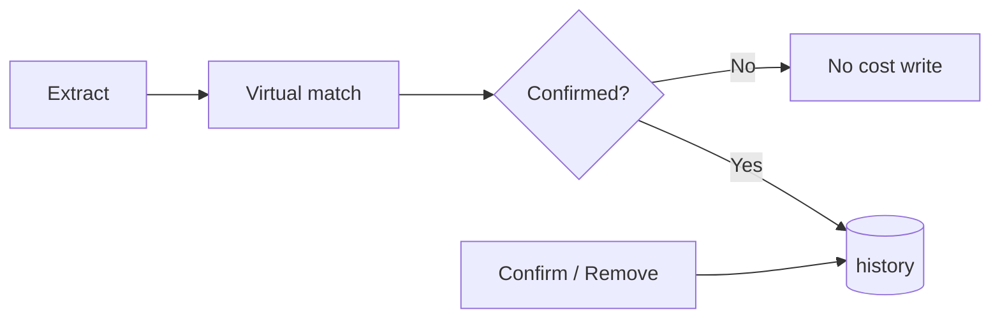
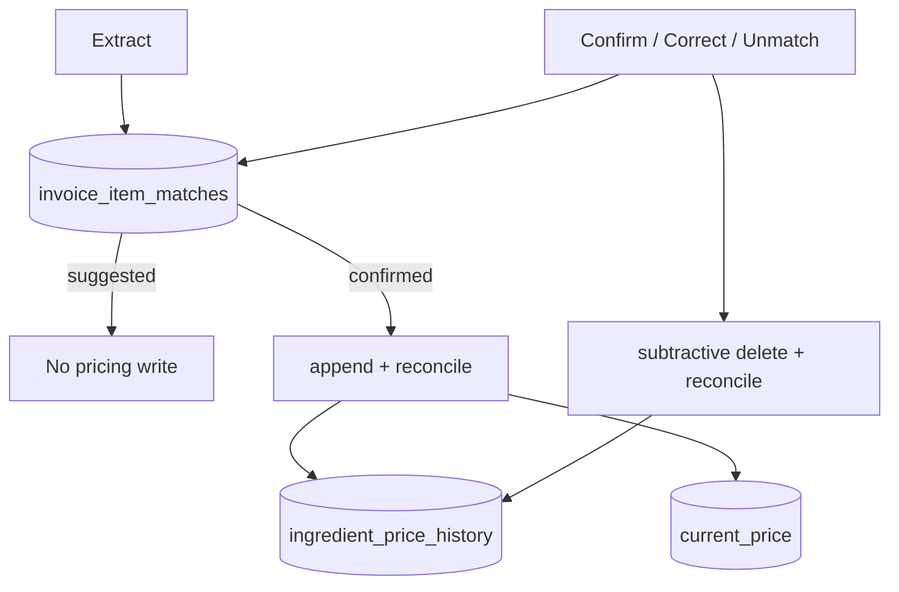
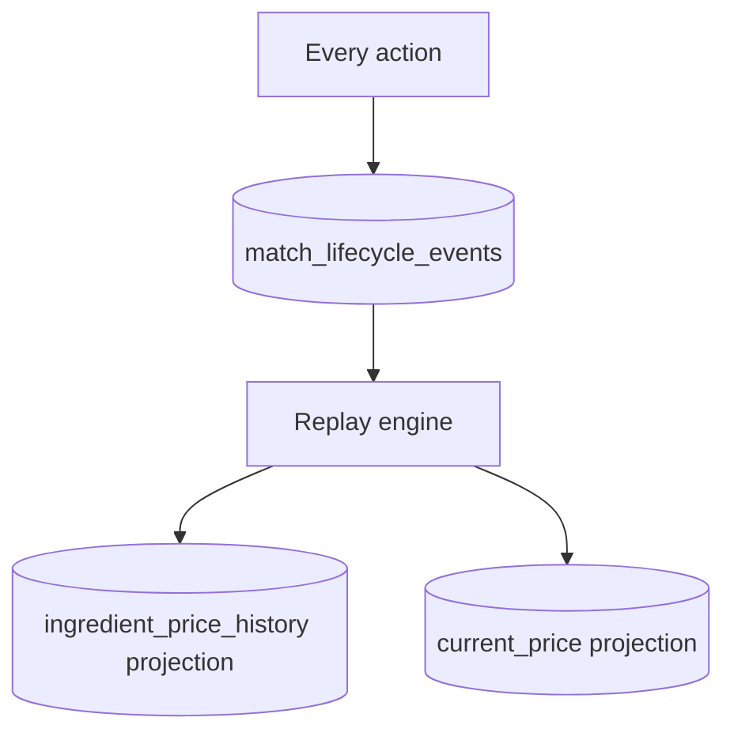

# Match Lifecycle V1 — Migration Options

**Mode:** READ-ONLY architecture design · **Generated:** 2026-06-14  
**Evidence base:** `.tmp/match-lifecycle-design-investigation/TARGET_LIFECYCLE_OPTIONS.md`, `.tmp/match-lifecycle-foundations-audit/REBUILDABILITY_MATRIX.json`, `.tmp/remove-match-investigation/`, `.tmp/pepino-contamination-timeline/`

---

## Options Compared

Three migration postures for closing the lifecycle gap:

| Option | Name | Essence |
|--------|------|---------|
| **A** | Minimal lifecycle layer | Gate extract sync + Remove Match UI; no new match table |
| **B** | Lifecycle + partial derived pricing | Persisted match record + gated materialized history |
| **C** | Fully derived pricing | Event-sourced lifecycle; history/current_price always recomputed |

---

## Option A — Minimal Lifecycle Layer (Gate + UI Only)

### Description

No new persisted match table. Application logic changes only:

- `syncOperationalIngredientCostsFromInvoiceLines` skips until user confirms
- Add **Remove Match** UI with history DELETE + `reconcileIngredientPriceHistoryChain`
- Promote high-risk auto `exact` matches to suggested in UI
- Optionally promote reject pairs to server

### Architecture sketch

### Complexity

**Low** — primarily application logic; no schema migration for match SoT.

### Risk

| Risk | Level | Detail |
|------|-------|--------|
| Migration | **Low** | No new tables |
| Re-poison on backfill | Medium | Matcher replay still ungated |
| Reassign orphan | **High** | Without line-level SoT, subtractive cleanup is heuristic `(invoice_id, ingredient_id)` |
| Pepino bare exact | Medium | UI promotion helps; no persisted tombstone |
| Cross-device reject | Medium | localStorage remains |

### Reversibility

**Partial** — Remove Match + explicit DELETE helps; reassignment still lacks atomic line binding. Dual attribution possible (`.tmp/match-correction-reversal-audit/` — 2 rows same invoice).

### OI impact

| Aspect | Impact |
|--------|--------|
| New invoices | **High positive** — stops pre-review contamination |
| Existing data | **Limited** — orphan rows remain until manual remediation |
| Production OI | Blocked until remed. — same as today |

### Rebuildability

**Partial** — no per-line SoT; alias/reject scattered (Supabase + localStorage). Aligns with TARGET_LIFECYCLE_OPTIONS Option 1 verdict: **necessary first increment but insufficient**.

---

## Option B — Lifecycle + Partial Derived Pricing ⭐

### Description

Introduce `invoice_item_matches` as single persisted record per line. Cost projections materialized on `status=confirmed` transitions only. Reuse append, reconcile, backfill — gated on confirmed matches.

### Architecture sketch

### Complexity

**Medium** — one new table, lifecycle service layer, wire existing reconcile/backfill to transitions.

### Risk

| Risk | Level | Detail |
|------|-------|--------|
| Migration | **Medium** | Seed match records for existing invoices |
| VL 11 extract-synced lines | Medium | Retro classify suggested vs confirmed from matcher kind |
| Poison remediation | Medium | Pepino `a689bd91`, Mozzarella chain — one-time DELETE |
| Auto-confirm policy | Medium | Must not repeat Pepino bare exact path |
| Dual-write window | Low | Single cutover if match record is read/write authority |

### Reversibility

**High** — match record + subtractive transitions + reconcile. Full correction/unmatch/reassign support per `LIFECYCLE_TRANSITIONS.md`.

### OI impact

| Aspect | Impact |
|--------|--------|
| New invoices | **High positive** — clean confirmed-only inputs |
| Existing data | Requires remediation pass |
| Production OI | **On path** after remed. + VL re-read green |
| P0 guard | Demoted to safety net |

### Rebuildability

**High** — `backfillIngredientPriceHistoryFromInvoices` filters confirmed matches only; reconcile repairs chains (`.tmp/match-lifecycle-foundations-audit/REBUILDABILITY_MATRIX.json`).

### Nullable `pack_variant_id`

Include in schema design — P1 additive without lifecycle rewrite (`.tmp/match-lifecycle-design-investigation/DECISION_MATRIX.md`).

---

## Option C — Fully Derived Pricing

### Description

Append-only `match_lifecycle_events`. Every transition immutable. `ingredient_price_history` and `current_price` **fully recomputed** from event log via replay on every transition or batch job.

### Architecture sketch

### Complexity

**High** — event schema, replay engine, idempotency, snapshot optimization, cutover strategy.

### Risk

| Risk | Level | Detail |
|------|-------|--------|
| Migration | **High** | Reconstruct event log from current DB is **lossy** — no audit trail today |
| Dual-write window | **High** | Read cutover while replay stabilizes |
| Recipe cost drift | Medium | Wrong replay ordering |
| Operational | High | Team capacity; ERP complexity |

### Reversibility

**Maximum** — by design; any projection rebuildable from event log.

### OI impact

| Aspect | Impact |
|--------|--------|
| Steady state | **High positive** — audit-grade inputs |
| During migration | **Risk** — dual-write / read-cutover |
| Marginly fit | **Poor** — violates "Simple UX, No ERP complexity" |

### Rebuildability

**Maximum** — but requires building replay infrastructure not present today.

Verdict from prior investigation: correct long-term shape; **over-engineered for V1** (TARGET_LIFECYCLE_OPTIONS Option 3).

---

## Side-by-Side Matrix

| Criterion | A Minimal | B Lifecycle + hybrid pricing | C Fully derived |
|-----------|:---------:|:----------------------------:|:---------------:|
| Implementation complexity | Low | **Medium** | High |
| Schema migration | None | **One table** | Table + events + replay |
| Migration risk | Low | **Medium** | High |
| Reversibility | Partial | **High** | Maximum |
| Stops Pepino pre-review | Yes (if gated) | **Yes** | Yes |
| Subtractive correction | Partial | **Full** | Full |
| Production unmatch | Yes (if shipped) | **Full** | Full |
| Per-line SoT | **No** | **Yes** | Yes |
| Reuses reconcile/backfill | Partial | **Yes** | Rewires |
| OI production path | Partial | **Yes** | Yes (delayed) |
| Pack variant ready | Weak | **Strong** (nullable column) | Strong |
| Marginly simplicity | Good | **Best fit** | Poor |
| Reversibility of migration itself | Easy rollback | **Match record can coexist with virtual read fallback** | Hard rollback |

---

## Existing Data Migration (Option B detail)

### Seed match records

For each `invoice_item` in VL and production:

| Current runtime state | Seed status | Notes |
|----------------------|-------------|-------|
| unmatched (40/51 VL) | `unmatched` | No ingredient_id |
| suggested (4/51) | `suggested` | **Delete** any extract-synced history if present |
| confirmed (7/51) | `confirmed` | Keep history if attributable |
| extract-synced without confirm (Pepino class) | `suggested` + remediate history | 11 lines per remove-match investigation |

### Remediation pass

1. DELETE orphan history rows (wrong ingredient attribution)
2. `reconcileIngredientPriceHistoryChain` per affected ingredient
3. Promote localStorage reject pairs to server log
4. VL re-read audit — target green before OI production

### Rollback strategy

- Match record table can be read-only shadow during canary
- Virtual match remains fallback until cutover flag
- History rows unchanged until confirm gate enforced — reversible within dual-read window

Option A rollback is trivial (logic flag). Option C rollback is **hard** (event log is authoritative).

---

## Recommendation Within Migration Options

**Option B** — smallest **architectural** fix that closes the foundations verdict:

> "Requires introducing a new source-of-truth entity — no existing table binds line → ingredient → status → history atomically."

Option A is a valid **increment** (ship gate + Remove Match quickly) but **insufficient alone** for reassignment subtractive semantics and line-level attribution.

Option C deferred until audit/compliance requirements justify event store.

---

## Evidence Cross-References

| Finding | Source |
|---------|--------|
| 46/51 VL unmatched; 11 extract-synced | `.tmp/remove-match-investigation/REPORT.md` |
| Option comparison | `.tmp/match-lifecycle-design-investigation/TARGET_LIFECYCLE_OPTIONS.md` |
| Wrong rows not rebuildable | `.tmp/match-lifecycle-foundations-audit/REBUILDABILITY_MATRIX.json` |
| Pepino orphan persists | `.tmp/match-correction-reversal-audit/` |
| Foundations gap | `.tmp/match-lifecycle-foundations-audit/FINAL_VERDICT.md` |
| Partial lifecycle code 2 | `.tmp/match-lifecycle-architecture-audit/FINAL_VERDICT.md` |
