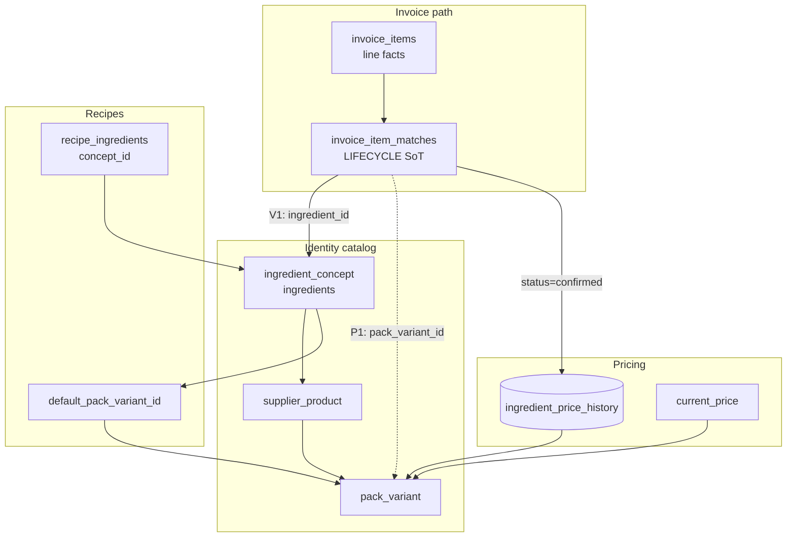

# Match Lifecycle V1 — Pack Variant Integration

**Mode:** READ-ONLY architecture design · **Generated:** 2026-06-14  
**Evidence base:** `.tmp/match-lifecycle-design-investigation/PACK_VARIANT_INTERACTION.md`, `.tmp/ingredient-identity-future-design/`, `.tmp/identity-contamination-audit/`, `.tmp/pepino-contamination-timeline/recommendation.json`

---

## Sequencing Constraint

**Lifecycle first, Pack Variants P1 second.**

Evidence: `pack_variants_without_workflow_fix.safe: false` (`.tmp/pepino-contamination-timeline/recommendation.json`). Variants split catalog formats but **do not gate extract sync** or provide subtractive correction semantics (`.tmp/match-lifecycle-design-investigation/PACK_VARIANT_INTERACTION.md`).

| Rank | Workstream | Rationale |
|------|------------|-----------|
| 1 | Match lifecycle (P0) | Stops pre-review poison regardless of catalog shape |
| 2 | Matcher guards | Reduces wrong suggestions |
| 3 | Pack Variants P1 | Closes catalog collapse; variant-scoped chains |

---

## North-Star Identity Model (Option E)

From `.tmp/ingredient-identity-future-design/REPORT.md`:

```
ingredient_concept (ingredients)
  └── supplier_product
        └── pack_variant (piece, block, jar, kg, volume)
              └── ingredient_price_history (chain scoped per variant)
              └── current_price (per variant or via default)
```

Recipes bind to **concept**; costing reads **default_pack_variant**; invoice lines match to **pack_variant** at P1.

---

## Attachment Points: Where Each Layer Lives



### Summary table

| Concern | Attaches to | V1 | P1 |
|---------|-------------|----|----|
| **Lifecycle state** | `invoice_item_matches` | `status`, timestamps | unchanged |
| **Concept match** | `invoice_item_matches.ingredient_id` | required for assignment | unchanged |
| **Format/SKU match** | `invoice_item_matches.pack_variant_id` | NULL (nullable column) | required for cost sync |
| **Pricing history** | `pack_variant_id` (P1) / `ingredient_id` (V1) | per concept | per variant |
| **current_price** | variant row (P1) / concept (V1) | concept snapshot | variant snapshot |
| **Recipe binding** | `ingredient_concept_id` | unchanged | + optional variant override |
| **Aliases** | wording → variant (P2) / ingredient (V1) | ingredient_id | pack_variant_id + contract |

---

## V1 Lifecycle Without Variants

Pre-P1, lifecycle operates at **concept level**:

```
invoice_items
  └── invoice_item_matches
        ├── ingredient_id (concept)
        ├── status / match_kind / timestamps
        └── pack_variant_id = NULL

Confirmed → appendIngredientPriceHistoryFromInvoiceLine(ingredient_id)
Recipe costing → ingredients.current_price
```

This **closes Pepino and correction reversal** without waiting for full Option E schema.

Known limitation: Mozzarella piece vs block remains one concept — P0 guard + lifecycle gate reduce poison; **P1 splits variants**.

---

## P1 Additive Extension (no lifecycle rewrite)

```
invoice_items
  └── invoice_item_matches
        ├── ingredient_id (concept — unchanged)
        ├── pack_variant_id (nullable → required for cost sync)
        ├── status / timestamps
        └── previous_ingredient_id / previous_pack_variant_id

Confirmed → history.append(pack_variant_id)
Recipe costing → concept.default_pack_variant_id → variant.current_price
History chains → scoped per pack_variant_id only
```

**Match record is the stable join point.** P1 adds a column; lifecycle semantics (suggest, confirm, correct, unmatch) unchanged.

Design match record with nullable `pack_variant_id` **now** to avoid second lifecycle rewrite (`.tmp/match-lifecycle-design-investigation/DECISION_MATRIX.md` Option C design-only).

---

## How Lifecycle First Simplifies Pack Variants

| P1 concern | Lifecycle-first benefit |
|------------|-------------------------|
| `price_history.pack_variant_id` FK | Match record provides per-line anchor |
| Variant-scoped history chains | Unmatch deletes one variant row; reconcile within variant |
| Alias → variant binding | Confirm transition writes alias with variant context |
| Cross-format auto-match poison | Gated sync prevents pre-review writes to wrong variant |
| VL backfill / migration | Match records classify which lines belong to which variant |
| Invoice-item attribution | History currently lacks `invoice_item_id` FK — match record supplies it |

Evidence: `.tmp/recipe-identity-compatibility-audit/future-state-model.json` — invoice path requires `invoice_items → match → supplier_product → pack_variant → price_history.append`.

---

## Why Pack Variants First Does NOT Simplify Lifecycle

| Scenario | Variants alone insufficient |
|----------|----------------------------|
| **Pepino** | Fresh vs conserva may split to variants OR concepts — extract still writes if match resolves before review |
| **Mozzarella** | Piece vs block helps catalog — correction still orphans history without subtractive semantics |
| **Ginger Beer** | Volume variant helps identity — latent €575/L if sync runs on wrong parse before confirm |
| **Correction** | Reassign between variants orphans old-variant row; reconcile not invoked today |
| **Unmatch** | No handler regardless of variant model |

Variants split **formats**; they do **not** gate extract sync or provide per-line reversibility.

---

## Matcher Evolution (P1)

| V1 matcher output | P1 matcher output |
|-------------------|-------------------|
| `ingredient_id` | `ingredient_id` + proposed `pack_variant_id` |
| Match record stores both when available | Cost sync requires variant |

Supplier product resolver sits between concept and variant (P2). Lifecycle transitions unchanged — assignment target becomes variant-scoped.

---

## Aliases and Reject Memory

| Artifact | V1 | Lifecycle + P1 |
|----------|----|----|
| `ingredient_aliases` | Wording → ingredient | Evolves to pack_variant binding + contract snapshot (P2) |
| `rejected-ingredient-matches` | Client localStorage | Server-side reject log; variant-aware at P1 |
| Write authority | Confirm/correct transitions | Same — aliases derived from confirmed matches |

Aliases stay **derived from confirmed matches**, not independent SoT (`.tmp/match-lifecycle-design-investigation/PACK_VARIANT_INTERACTION.md`).

---

## Hybrid Sequencing (production)

**Do:**

- Ship lifecycle match record with `ingredient_id` first
- Include nullable `pack_variant_id` column in schema design
- Add variant binding when P1 lands
- Reuse same subtractive correction/unmatch semantics at variant scope

**Do not:**

- Ship P1 auto-sync to `pack_variant_id` before confirmed-match gate
- Run lifecycle + full Option E schema migration in one production cutover

---

## VL Failure Mapping

| Failure | Lifecycle V1 | + Pack Variants P1 |
|---------|--------------|-------------------|
| Pepino fresh → conserva | Gate stops pre-review write; unmatch deletes orphan | Split concepts/variants; no cross-form chain |
| Mozzarella piece/block | Correction subtractive; guard on read | Separate variant chains |
| Ginger Beer 0.20cl | Gate stops premature sync | Volume variant + parse guard |
| 14/20 ghost history rows | Remediation + confirmed-only backfill | Variant-scoped cleanup |

---

## Evidence Cross-References

| Finding | Source |
|---------|--------|
| Variants without workflow unsafe | `.tmp/pepino-contamination-timeline/recommendation.json` |
| Lifecycle first simplifies P1 | `.tmp/match-lifecycle-design-investigation/PACK_VARIANT_INTERACTION.md` |
| Option E north star | `.tmp/ingredient-identity-future-design/REPORT.md` |
| 2/9 contaminated at concept level | `.tmp/identity-contamination-audit/REPORT.md` |
| Decision matrix winner: Lifecycle First | `.tmp/match-lifecycle-design-investigation/DECISION_MATRIX.md` |
