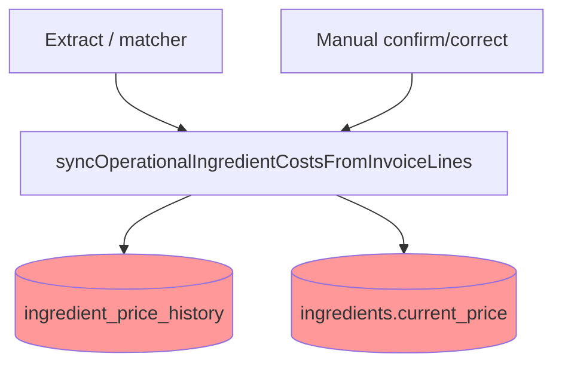
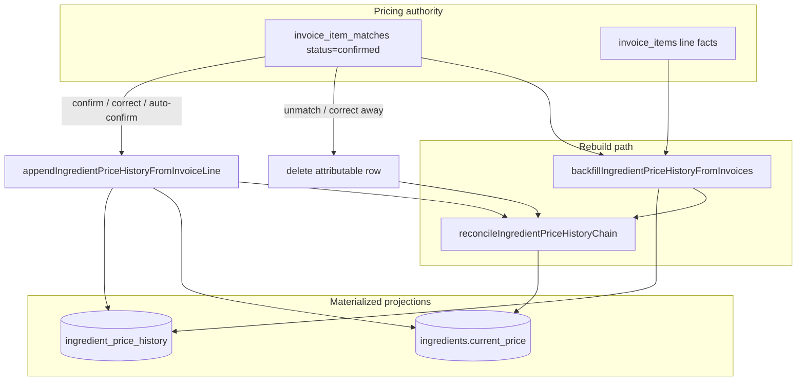
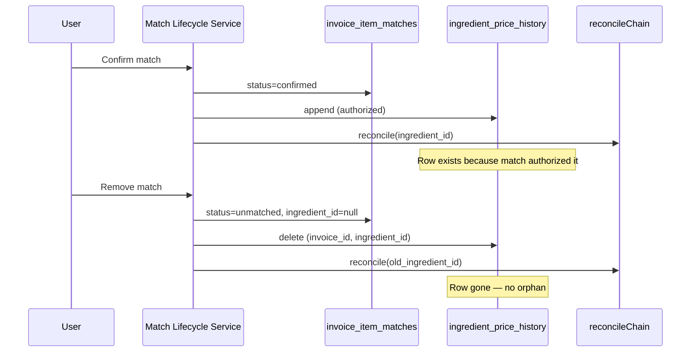

# Match Lifecycle V1 — Pricing Ownership Design

**Mode:** READ-ONLY architecture design · **Generated:** 2026-06-14  
**Evidence base:** `.tmp/match-lifecycle-foundations-audit/REBUILDABILITY_MATRIX.json`, `.tmp/pepino-contamination-timeline/`, `.tmp/match-correction-reversal-audit/`, `.tmp/identity-contamination-audit/`

---

## Question

What owns `ingredient_price_history` and `ingredients.current_price`?

Three architectural postures:

| Posture | Description |
|---------|-------------|
| **Persisted facts** | History and current_price written eagerly; independent of match state (today) |
| **Derived projections** | Recomputed from confirmed match records + line facts on every read or transition |
| **Hybrid** | Materialized projections written on lifecycle events; rebuildable from match SoT |

---

## Current State (Persisted Facts — Incoherent)



**Problems (evidence):**

1. Cost sync runs for suggested **and** confirmed before review (`ingredient-operational-intelligence.ts:933`)
2. History keyed `(invoice_id, ingredient_id)` — **no `invoice_item_id` FK** (`.tmp/match-lifecycle-foundations-audit/SOURCE_OF_TRUTH_MATRIX.json`)
3. Correction adds new-target row; **old-target orphan persists** (Pepino `a689bd91` — `.tmp/match-correction-reversal-audit/`)
4. `current_price` last-write-wins; **no revert on old target** (Mozzarella + Pepino — `.tmp/identity-contamination-audit/REPORT.md`)
5. Backfill replays matcher — would re-poison without match gate (REBUILDABILITY_MATRIX caveat)

Classification today: both tables marked SoT in foundations audit — but they behave as **unauthorized projections** because write triggers don't respect match intent.

---

## V1 Recommendation: Hybrid (Materialized Projection)

**Owner of pricing truth:** confirmed `invoice_item_matches` records + `invoice_items` line facts.

**`ingredient_price_history` and `current_price`:** materialized caches rebuilt on lifecycle transitions and repairable via existing services.



### Write rules

| Event | history | current_price |
|-------|---------|---------------|
| Extract → suggested | No write | No write |
| Extract → confirmed (policy) | Append | Update |
| Confirm | Append | Update |
| Correct (A→B) | Delete A row; append B row | Reconcile A; update B |
| Unmatch | Delete row | Reconcile ingredient |
| Re-extract (confirmed) | Refresh row if line price changed | Update |
| Invoice delete | Existing `reconcileAfterInvoiceDelete` | Reconcile |

---

## `ingredient_price_history` — Detailed Ownership

### V1: Hybrid materialized

| Aspect | Design |
|--------|--------|
| **Logical owner** | Set of confirmed match records |
| **Physical storage** | Retain existing table — operational audit trail, OI input |
| **Row identity** | `(invoice_id, ingredient_id)` today; **target** `(invoice_item_id)` or `(invoice_id, ingredient_id, invoice_item_id)` at implementation |
| **Append trigger** | Lifecycle service on `status=confirmed` only |
| **Delete trigger** | Unmatch + correct-away (subtractive) |
| **Rechain trigger** | `reconcileIngredientPriceHistoryChain` after every append/delete |

### Fully derived (future — Option C)

Recompute entire history from confirmed matches + line facts on demand or via batch job. No manual row edits.

**Pros:** Perfect coherence; trivial unmatch (drop from projection input).  
**Cons:** Expensive at scale; OI reads need snapshot strategy; migration cutover risk.  
**Verdict:** Over-engineered for V1 (`.tmp/match-lifecycle-design-investigation/TARGET_LIFECYCLE_OPTIONS.md`).

### Persisted facts (status quo)

**Rejected** — proven to cause Pepino contamination and irreversible correction orphans.

---

## `ingredients.current_price` — Detailed Ownership

### V1: Derived snapshot (materialized)

| Aspect | Design |
|--------|--------|
| **Logical owner** | Latest trusted operational price from history chain |
| **Write trigger** | Same as history append + reconcile completion |
| **Revert** | `reconcileIngredientPriceHistoryChain` → `fetchLatestHistoryNewPrice` |
| **Read consumers** | recipes.tsx, margin-alert-data, ingredient-detail-panel |

Today `current_price` is updated on sync but **never reverted** on old ingredient when correcting (`.tmp/match-correction-reversal-audit/`).

### Target invariant

```
current_price(ingredient) = operational_unit_price(latest confirmed history row)
  after reconcile, excluding untrusted / deleted rows
```

P0 chain guard (`ingredient-price-chain-guard.ts`) remains read-path safety net until data clean (`.tmp/identity-contamination-audit/REPORT.md`).

---

## Tradeoff Matrix

| Dimension | Persisted facts (today) | Hybrid (V1) | Fully derived |
|-----------|------------------------|-------------|---------------|
| Pepino pre-review poison | **Fails** | **Prevented** | Prevented |
| Correction reversal | **Fails** | **Supported** | Supported |
| Query performance | Fast | Fast | Slower / needs cache |
| Implementation complexity | Low (status quo) | **Medium** | High |
| Reuses existing services | N/A | **Yes** — append, reconcile, backfill | Needs replay engine |
| OI trust | Low | **High** (after remed.) | High |
| Migration risk | N/A | Medium | High |
| Marginly simplicity | Illusory | **Aligned** | ERP-like |
| Pack variant ready | No line anchor | **Yes** — match record | Yes |

---

## Relationship to Match Lifecycle SoT



**Pricing never leads; match status leads.**

---

## OI and Read-Path Impact

| Consumer | V1 behavior |
|----------|-------------|
| `margin-alert-data` | Reads history; trusted rows = confirmed-match-attributable |
| `operational-intelligence-synthesis` | Clean inputs after remediation |
| `ingredient-price-chain-guard` | Safety net; demoted from primary fix |
| `ingredient-detail-panel` | Purchase fallback still needs guard until P1 variants |
| `recipes.tsx` | cost-changed on both old + new id on correction |

OI production enablement **after** lifecycle gate + poison remediation (`.tmp/ingredient-identity-future-design/REPORT.md`).

---

## Remediation (existing poison)

Hybrid model requires one-time cleanup for known bad rows:

| Case | Row | Action |
|------|-----|--------|
| Pepino | `a689bd91` on conserva | DELETE + reconcile conserva |
| Mozzarella | cross-format chain | DELETE wrong rows + reconcile |
| VL 11 extract-synced lines | per remove-match investigation | Classify match records; delete unconfirmed history |

Not a pricing ownership change — **aligns materialized state to new authority rules**.

---

## P1 Extension (pack_variant scoped pricing)

| V1 | P1 |
|----|-----|
| History keyed by `ingredient_id` | History keyed by `pack_variant_id` |
| Match record `ingredient_id` | + `pack_variant_id` required for cost sync |
| Reconcile per ingredient | Reconcile per variant |

Lifecycle ownership rules **unchanged** — only the projection key narrows. See `PACK_VARIANT_INTEGRATION.md`.

---

## Evidence Cross-References

| Finding | Source |
|---------|--------|
| Extract sync before review | `.tmp/pepino-contamination-timeline/REPORT.md` |
| Orphan history on correction | `.tmp/match-correction-reversal-audit/data-not-reverted.json` |
| current_price not reverted | `.tmp/match-correction-reversal-audit/REPORT.md` |
| Backfill replays matcher | `.tmp/match-lifecycle-foundations-audit/REBUILDABILITY_MATRIX.json` |
| 2/9 VL ingredients contaminated | `.tmp/identity-contamination-audit/REPORT.md` |
| reconcile exists, unwired | `ingredient-price-history-reconcile.ts:124` |
