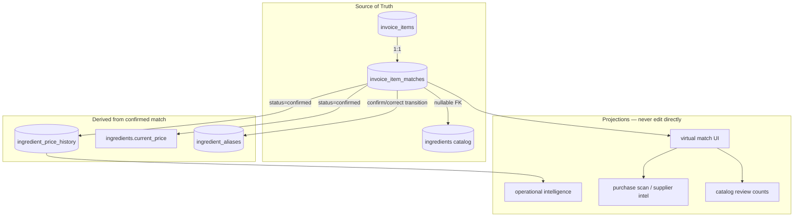

# Match Lifecycle V1 — Source of Truth Design

**Mode:** READ-ONLY architecture design · **Generated:** 2026-06-14  
**Evidence base:** `.tmp/match-lifecycle-foundations-audit/SOURCE_OF_TRUTH_MATRIX.json`, `.tmp/match-lifecycle-foundations-audit/FINAL_VERDICT.md`, `.tmp/match-lifecycle-design-investigation/FINAL_RECOMMENDATION.md`

---

## Core Principle

**One primary SoT** binds each invoice line to its current match assignment and lifecycle status. All cost side-effects are **projections authorized by that record**, not independent writes at extract time.

Today: effective match is **computed at read time** with no persisted binding (`.tmp/match-lifecycle-foundations-audit/SOURCE_OF_TRUTH_MATRIX.json` → `effective_match_source_of_truth: "none_persisted"`).

---

## Primary Source of Truth (new)

### `invoice_item_matches` (conceptual name)

One row per `invoice_item_id` (PK/FK).

| Field (conceptual) | Role |
|--------------------|------|
| `invoice_item_id` | PK — binds lifecycle to OCR line |
| `ingredient_id` | Nullable — current assignment |
| `status` | `unmatched` \| `suggested` \| `confirmed` |
| `match_kind` | Matcher provenance at last assignment |
| `confirmed_at` | When status became confirmed |
| `updated_at` | Last lifecycle transition |
| `previous_ingredient_id` | Last assignment before correct/reassign (V1 audit trail) |
| `pack_variant_id` | Nullable until P1 — additive, no lifecycle rewrite |

**Authoritative for:**

- Current match (which ingredient, if any)
- Match status (whether cost projection is allowed)
- Reassignment history (via `previous_ingredient_id` + timestamps; full event log deferred)



---

## Entity Classification Matrix

| Entity | Classification | V1 role | Notes |
|--------|---------------|---------|-------|
| `invoice_items` | **SoT** | Line facts (text, qty, price) | Unchanged; no `ingredient_id` column needed |
| `invoice_item_matches` | **SoT (new)** | Line → ingredient + status | Closes foundations gap |
| `ingredients` | **SoT** | Catalog identity | Concept layer; `current_price` demoted over time |
| `ingredient_aliases` | **SoT → derived** | Wording memory | Written on confirm/correct; **derived from confirmed matches** in steady state |
| `ingredient_price_history` | **Hybrid → projection** | Cost audit trail | V1: materialized on confirm; target: rebuildable from confirmed matches |
| `ingredients.current_price` | **Projection** | Latest operational snapshot | Rebuild via `fetchLatestHistoryNewPrice` + reconcile |
| Virtual match resolution | **Projection** | UI + matcher input | Reads match record first, then aliases/reject/matcher |
| `rejected-ingredient-matches` | **Cache → server log** | Wrong-pair blocklist | Promote to server; match record `unmatched` is authoritative tombstone |
| `confirmedIngredientAliases` map | **Cache** | Client mirror | Reload from Supabase |
| `ingredient_match_override` | **Cache** | Session override | Demoted when match record exists |
| `matched_invoice_products_cache` | **Cache** | TTL purchase memory | Invalidate on lifecycle transitions |
| `buildMatchedInvoiceProductsFromScan` | **Projection** | Supplier intel | Derived from lines + match records |
| `margin_alert_data` | **Projection** | Price movement alerts | Reads history + guard |
| `operational_intelligence_synthesis` | **Projection** | OI aggregates | Reads clean confirmed-cost inputs |
| `catalog_review_match_counts` | **Projection** | Live counts | From match records + matcher |
| `invoice_operational_metadata` | **Projection** | Row signals | Derived |
| `ingredient_price_chain_guard` | **Projection (read guard)** | P0 safety net | Does not mutate; bandage until lifecycle ships |
| `operational_ingredient_cost_changed_event` | **Signal** | Client invalidation | Fired on lifecycle cost transitions |

Source: `.tmp/match-lifecycle-foundations-audit/SOURCE_OF_TRUTH_MATRIX.json` — reclassified with V1 additions.

---

## Three Questions — Single Answers

### 1. Current match (line → ingredient)

| Layer | V1 SoT |
|-------|--------|
| **Answer** | `invoice_item_matches.ingredient_id` where `status ∈ {suggested, confirmed}` |
| **Not SoT** | Virtual matcher output, alias alone, history row alone |

Matcher runs at extract to **propose** assignment → writes/updates match record. User transitions change the record. Re-extract may re-run matcher but must respect `confirmed` records (policy: do not downgrade confirmed without user action).

### 2. Match status (suggested / confirmed / unmatched)

| Layer | V1 SoT |
|-------|--------|
| **Answer** | `invoice_item_matches.status` |
| **Not SoT** | `displayState` from matcher, UI-only Confirm button state |

### 3. Reassignment history

| Layer | V1 SoT |
|-------|--------|
| **Minimum (V1)** | `previous_ingredient_id` + `updated_at` on match record |
| **Optional (V1.1)** | Append-only `match_lifecycle_events` if audit requirements grow |
| **Not SoT** | Reject pair localStorage alone (matcher input, not history) |

Full event sourcing is **future evolution**, not V1 (`.tmp/match-lifecycle-design-investigation/TARGET_LIFECYCLE_OPTIONS.md` Option 3 verdict).

---

## Read Path Resolution Order (target)

Replace implicit virtual-only resolution:

```
1. invoice_item_matches (if row exists → authoritative status + ingredient_id)
2. rejected pair / server reject log (block specific ingredient for line wording)
3. ingredient_aliases (fast path for confirmed wording)
4. matcher (propose assignment when no record or re-extract policy allows)
5. session override (deprecated / lowest priority)
```

Virtual match becomes a **projection layer** that prefers persisted match record over re-derivation.

---

## Write Authority Rules

| Operation | May write | Must not write directly |
|-----------|-----------|-------------------------|
| Extract | `invoice_items`, `invoice_item_matches` (suggested/default) | `ingredient_price_history`, `current_price` (unless policy auto-confirms) |
| Confirm | match record → confirmed, alias, history, current_price | — |
| Correct / Reassign | match record, subtractive history delete, reconcile, alias, new history | Old-target history orphan |
| Unmatch | match record → unmatched, history delete, reconcile, optional alias delete | Leave poison rows |
| Re-extract | `invoice_items` refresh; match record per policy | Downgrade confirmed without rule |
| Backfill (admin) | Rebuild history from confirmed matches only | Suggested/unmatched lines |

---

## Coherence Fixes vs Today

| Today (incoherent) | V1 (coherent) |
|--------------------|---------------|
| Match = runtime projection | Match = persisted record |
| History keyed `(invoice_id, ingredient_id)` — no line FK | History append authorized by `invoice_item_id` via match record |
| Alias optional; exact bypasses confirm | Confirm transition writes alias; auto-confirm policy explicit |
| Reject pair in localStorage only | Server reject log + match tombstone |
| Cost sync independent of user intent | Cost sync gated on `status=confirmed` |

Evidence: Pepino history `a689bd91` persists on wrong ingredient after correction because history is not bound to line lifecycle (`.tmp/match-correction-reversal-audit/REPORT.md`).

---

## Rebuildability Implications

From `.tmp/match-lifecycle-foundations-audit/REBUILDABILITY_MATRIX.json`:

| Artifact | Today | With V1 SoT |
|----------|-------|-------------|
| Wrong history row | Not rebuildable without DELETE | Deletable via lifecycle transition |
| History missing rows | Backfill replays matcher (risky) | Backfill filters `status=confirmed` only |
| current_price | Rebuildable from history | Same; reconcile after transitions |
| Virtual match | Rebuildable | Replaced by match record read |

**Critical caveat:** `backfillIngredientPriceHistoryFromInvoices` replays matcher — match SoT must gate what counts as confirmed, or backfill re-poisons (REBUILDABILITY_MATRIX caveat).

---

## Pack Variant SoT Extension (P1 — design only)

Add nullable `pack_variant_id` to `invoice_item_matches`:

- V1: NULL — cost sync to `ingredient_id` (concept)
- P1: non-NULL required for cost sync — history scoped per variant

Lifecycle SoT **unchanged**; pricing SoT **narrows** to variant. See `PACK_VARIANT_INTEGRATION.md`.

---

## Evidence Cross-References

| Finding | Source |
|---------|--------|
| No unified match SoT | `.tmp/match-lifecycle-foundations-audit/FINAL_VERDICT.md` |
| Three decoupled writes | `.tmp/match-lifecycle-design-investigation/CURRENT_ARCHITECTURE.md` |
| History no invoice_item_id FK | `.tmp/match-lifecycle-foundations-audit/SOURCE_OF_TRUTH_MATRIX.json` |
| Alias not written on auto exact | `.tmp/pepino-contamination-timeline/REPORT.md` |
| Rebuild services exist, unwired | `.tmp/match-lifecycle-foundations-audit/REBUILDABILITY_MATRIX.json` |
