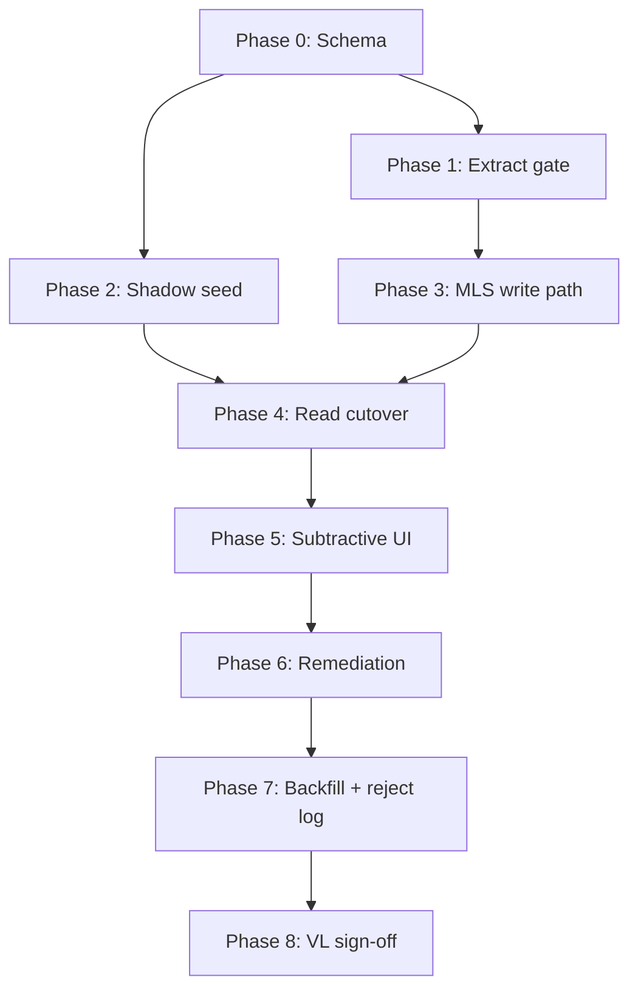

# Match Lifecycle V1 — Implementation Phases

**Mode:** READ-ONLY implementation planning · **Generated:** 2026-06-14  
**Approved design:** Option B (`invoice_item_matches` + gated hybrid pricing)  
**Constraint:** No code or migration SQL in this document.

---

## Answers to Planning Questions 1–4

### 1. Safest implementation order

| Order | Phase | Rationale |
|:-----:|-------|-----------|
| **0** | Schema foundation | Additive-only table; zero behavior change; VL unaffected |
| **1** | Extract cost gate | Stops new Pepino-class poison **before** full SoT cutover (`.tmp/pepino-contamination-timeline/REPORT.md`) |
| **2** | Shadow seed + classification | Validates 51-line VL taxonomy without read-path risk (`.tmp/remove-match-investigation/query-summary.json`) |
| **3** | Match Lifecycle Service (MLS) — write path | Centralizes transitions; still dual-read |
| **4** | Read-path cutover | Match record becomes authoritative; virtual match demoted to projection |
| **5** | Subtractive Correct + Remove Match UI | Closes verdict code 2/3 (`.tmp/match-correction-reversal-audit/verdict.json`) |
| **6** | Pre-OI data remediation | DELETE poison rows; reconcile chains |
| **7** | Backfill gate + server reject log | Prevents re-poison via admin paths |
| **8** | VL re-read + stable-pricing sign-off | Gate for OI production and Pack Variants P1 |

**Principle:** Gate writes first, persist SoT second, cutover reads third, remediate poison fourth. Never enable OI on dirty chains.

### 2. What can ship independently

| Deliverable | Independent? | Notes |
|-------------|:------------:|-------|
| `invoice_item_matches` schema + RLS | **Yes** | No app dependency |
| Extract cost gate (`confirmed` only) | **Yes** | Highest ROI isolation; stops pre-review writes at `invoices.tsx:1358` |
| Shadow seed script (admin-only) | **Yes** | Read-only validation of classification |
| Server `ingredient_match_rejections` table | **Yes** | Additive; localStorage fallback remains |
| Remove Match UI (without MLS) | **Partial** | Needs subtractive DELETE + reconcile wiring; safer after gate |
| MLS module | **No** | Depends on schema |
| Read-path cutover | **No** | Depends on seed completeness |
| Data remediation | **No** | Depends on match record line→ingredient binding |
| Backfill filter (`confirmed` only) | **Partial** | Can ship after Phase 1 gate; full value after seed |

### 3. Prerequisites between changes

| Phase | Hard prerequisites |
|-------|------------------|
| 1 | None (can precede schema if gate uses alias-only heuristic) |
| 2 | Phase 0 schema |
| 3 | Phase 0 + Phase 1 (no new poison during MLS development) |
| 4 | Phase 2 seed validated; dual-read tests green |
| 5 | Phase 4 (subtractive ops need line SoT) |
| 6 | Phase 5 Remove Match available for Pepino replay |
| 7 | Phase 6 (backfill must not re-insert deleted rows) |
| 8 | Phase 6 + Phase 7 |

### 4. What can be feature-flagged

No centralized feature-flag system exists today (grep: no `featureFlag` / `FEATURE_` in `src/`). Recommend **environment or localStorage flags** for incremental rollout:

| Flag | Phase | Default | Purpose |
|------|:-----:|---------|---------|
| `MATCH_LIFECYCLE_EXTRACT_GATE` | 1 | `off` → `on` | Skip cost sync unless `confirmed` or alias-hit auto-confirm |
| `MATCH_LIFECYCLE_SHADOW_WRITE` | 2–3 | `off` | Upsert `invoice_item_matches` without affecting reads |
| `MATCH_LIFECYCLE_READ_FROM_RECORD` | 4 | `off` | `resolveInvoiceTableRowIngredientMatch` prefers persisted record |
| `MATCH_LIFECYCLE_MLS_WRITES` | 3–5 | `off` | Route confirm/correct/unmatch through MLS |
| `MATCH_LIFECYCLE_REMOVE_MATCH` | 5 | `off` | Expose Remove Match UI action |
| `MATCH_LIFECYCLE_ALIAS_AUTO_CONFIRM` | 1 | `on` (conservative: `off`) | Alias-only auto-confirm at extract |
| `MATCH_LIFECYCLE_SERVER_REJECT_LOG` | 7 | `off` | Read/write server reject table vs localStorage |
| `MATCH_LIFECYCLE_BACKFILL_CONFIRMED_ONLY` | 7 | `off` | Gate `backfillIngredientPriceHistoryFromInvoices` |

P0 `ingredient-price-chain-guard` remains **always on** — not flaggable (read safety net per `.tmp/identity-contamination-audit/REPORT.md`).

---

## Phase Specifications

### Phase 0 — Schema Foundation

**Objective:** Create persisted per-line match SoT container without changing runtime behavior.

**Scope:**
- `invoice_item_matches` table (see `DATABASE_PLAN.md`)
- RLS policies aligned with `invoice_items` ownership chain
- Nullable `pack_variant_id` for P1 forward compatibility (`.tmp/match-lifecycle-v1-design/PACK_VARIANT_INTEGRATION.md`)

**Dependencies:** None.

**Risks:** Low — additive DDL only.

**Validation criteria:**
- Table exists; empty or unreferenced by app
- VL extract/review unchanged
- `scripts/vl-cleanup-investigation.mts` baseline counts unchanged

**Evidence:** Foundations verdict requires new SoT entity (`.tmp/match-lifecycle-foundations-audit/FINAL_VERDICT.md` §6).

---

### Phase 1 — Extract Cost Gate (Poison Stop)

**Objective:** Stop pre-review cost writes — closes Pepino root cause immediately.

**Scope:**
- Change `syncOperationalIngredientCostsFromInvoiceLines` gate at line 933: skip unless `status=confirmed` equivalent
- Interim (pre-MLS): use alias-hit or explicit confirm signal; demote bare `exact` to no-sync
- Remove or guard `invoices.tsx:1358` post-extract sync for non-confirmed lines
- Auto-confirm policy: **alias-only** (recommended) or **conservative all-suggested**

**Dependencies:** None strictly; schema optional at this phase.

**Risks:**
- **Medium:** 4 VL suggested + 11 extract-synced lines lose automatic history until user confirms
- **Low:** Confirmed-alias lines (7/51) continue syncing if alias policy enabled

**Validation criteria:**
- Re-extract Bidfood Pepino: **no** new `ingredient_price_history` row without confirm
- 7 confirmed-alias VL lines still sync when policy = alias-only
- `ingredient-operational-intelligence.test.ts` updated expectations
- VL financial extraction metrics unchanged (`.tmp/validation-lab-closure-audit/executive-summary.json`)

**Evidence:** `syncOperationalIngredientCostsFromInvoiceLines` skips only `unmatched` today (`src/lib/ingredient-operational-intelligence.ts:933`); Pepino wrote `a689bd91` at extract (`.tmp/pepino-contamination-timeline/REPORT.md` §7).

---

### Phase 2 — Shadow Seed + Classification

**Objective:** Populate `invoice_item_matches` for all existing lines; validate Option B seed taxonomy.

**Scope:**
- Admin script: for each `invoice_item`, run matcher + alias check → seed `status`, `ingredient_id`, `match_kind`
- Classification rules per `MIGRATION_OPTIONS.md`:
  - 40 unmatched → `unmatched`
  - 4 suggested → `suggested`
  - 7 confirmed → `confirmed`
  - 11 extract-synced without confirm → `suggested` + flag for history cleanup
- **No read-path change** — shadow mode only

**Dependencies:** Phase 0 schema.

**Risks:**
- **Medium:** Misclassification of Pepino line (must be `suggested`, not `confirmed`)
- **Low:** Script idempotency on re-run

**Validation criteria:**
- 51/51 VL lines have match records
- Pepino line `8e9e727a` → `suggested`, ingredient `635a1189`
- Counts match `.tmp/remove-match-investigation/query-summary.json`
- Shadow vs virtual match diff report = 0 unexpected for confirmed-alias lines

---

### Phase 3 — Match Lifecycle Service (Write Path)

**Objective:** Single write authority for all transitions (T1–T8 per `LIFECYCLE_TRANSITIONS.md`).

**Scope:**
- New module: `match-lifecycle-service.ts` (conceptual name)
- Extract: upsert match record (T1/T2); **no** direct cost sync
- Confirm/Correct: delegate from `invoices.tsx` handlers
- Wire `appendIngredientPriceHistoryFromInvoiceLine`, `reconcileIngredientPriceHistoryChain`, `dispatchOperationalIngredientCostChanged`
- Dual-write: match record + legacy virtual path (reads still virtual)

**Dependencies:** Phase 0, Phase 1 (gate active).

**Risks:**
- **High:** Transition ordering bugs (append before delete on correct)
- **Medium:** Idempotency on re-extract for confirmed lines

**Validation criteria:**
- Unit tests per transition matrix
- Extract on new invoice creates `suggested` records only (conservative policy)
- Confirm creates first history row (not refresh of pre-existing)
- `ingredient-price-history-persistence.test.ts` patterns extended

**Evidence:** Today transitions scattered in `invoices.tsx` (`persistIngredientCorrectionForItem` ~1702, `confirmIngredientMatch` ~1882, `handleSelectCorrectionIngredient` ~2944).

---

### Phase 4 — Read-Path Cutover

**Objective:** `invoice_item_matches` becomes authoritative for status + assignment.

**Scope:**
- Update `resolveInvoiceTableRowIngredientMatch` resolution order (`.tmp/match-lifecycle-v1-design/SOURCE_OF_TRUTH_DESIGN.md` §Read Path)
- Update consumers: `catalog-review-current-matches.ts`, `buildMatchedInvoiceProductsFromScan`, `ingredient-price-history-backfill.ts` matcher input
- `displayState` derived from `status` + `match_kind`
- Re-extract policy: preserve `confirmed` records (T8 re-extract table)

**Dependencies:** Phase 2 seed validated; Phase 3 write path live.

**Risks:**
- **High:** UI regressions — suggested lines showing as confirmed
- **Medium:** Catalog review count drift

**Validation criteria:**
- Pepino shows **Suggested** in review UI, not Confirmed chip
- `catalog-review-current-matches.test.ts` green
- Purchase scan excludes suggested lines from confirmed-cost inputs
- Dual-read canary: flag off = legacy behavior preserved

---

### Phase 5 — Subtractive Correct + Remove Match

**Objective:** Full reversibility — verdict code 2 → pass; scenario B supported.

**Scope:**
- **Remove Match** UI in `IngredientCorrectionActions` / `InvoiceIngredientCorrectionPicker`
- Wire `rejectIngredientMatchSuggestion` → MLS `transitionToUnmatched` (T4/T5)
- T7 correct: DELETE old `(invoice_id, old_ingredient_id)` history + reconcile both ids
- `dispatchOperationalIngredientCostChanged` fires **both** old and new ids
- Optional: "— No match —" picker sentinel

**Dependencies:** Phase 4 (line SoT for attributable DELETE).

**Risks:**
- **Highest:** Wrong history row deleted (no `invoice_item_id` FK on history today — attribution via match record + invoice_id + ingredient_id)
- **Medium:** Alias orphan policy on unmatch

**Validation criteria:**
- Pepino Remove Match deletes `a689bd91`; conserva chain reconciles to jar-only rows
- Correction A→B deletes A history on same invoice; no dual attribution
- `rejectIngredientMatchSuggestion` has production caller
- Manual replay of `.tmp/match-correction-reversal-audit/` scenarios

**Evidence:** `rejectIngredientMatchSuggestion` zero production callers (`.tmp/match-correction-reversal-audit/REPORT.md`); reconcile not invoked on correction (`verdict.json` Q8).

---

### Phase 6 — Data Remediation (Pre-OI)

**Objective:** Align materialized pricing with new authority rules for known poison.

**Scope:** See `DATA_REMEDIATION_PLAN.md` — Pepino `a689bd91`, Mozzarella cross-format rows, 11 extract-synced ghost history, alias audit.

**Dependencies:** Phase 5 (Remove Match for interactive cleanup); admin DELETE scripts for batch.

**Risks:**
- **Medium:** Over-deletion of legitimate history
- **Low:** `current_price` transient wrong until reconcile completes

**Validation criteria:**
- `identity-contamination-audit` re-run: 0/9 HIGH contamination (or Pepino/Mozzarella resolved)
- `purchaseContractsChainCompatible` passes for all multi-purchase ingredients
- 20 VL `price_history` rows → ≤14 after ghost cleanup (`.tmp/identity-contamination-audit/REPORT.md` §Facts)

---

### Phase 7 — Backfill Gate + Server Reject Log

**Objective:** Close admin/matcher replay re-poison paths.

**Scope:**
- `backfillIngredientPriceHistoryFromInvoices`: filter `invoice_item_matches.status = confirmed` only
- Promote `rejected-ingredient-matches` localStorage → Supabase table
- Matcher reads server reject log first

**Dependencies:** Phase 6 remediation complete.

**Risks:**
- **Medium:** Backfill under-fills history for legitimately confirmed lines if seed wrong
- **Low:** Cross-device reject sync migration

**Validation criteria:**
- Backfill on VL produces 0 new rows for suggested/unmatched lines
- Re-match blocked for Pepino→conserva pair after server reject
- `REBUILDABILITY_MATRIX` caveat closed (`.tmp/match-lifecycle-foundations-audit/REBUILDABILITY_MATRIX.json`)

---

### Phase 8 — VL Re-read + Stable Historical Pricing Sign-off

**Objective:** Prove lifecycle closure before OI production and Pack Variants P1.

**Scope:**
- Re-run VL harness: `scripts/validate-wave2a.mts`, `scripts/vl-cleanup-investigation.mts`, `.tmp/final-validation-lab-rerun-v30/run-audit.mts`
- Identity re-audit: `.tmp/identity-contamination-audit/run-audit.mts`
- Extraction phase remains closed (`.tmp/validation-lab-closure-audit/executive-summary.json`)

**Dependencies:** Phases 1–7 complete.

**Risks:** Low — validation only.

**Validation criteria:** See `VALIDATION_PLAN.md` Phase 8 success criteria.

---

## Phase Risk Summary (Question 11 preview)

| Phase | Risk level | Primary failure mode |
|-------|:----------:|---------------------|
| 0 | Low | RLS misconfiguration |
| 1 | Medium | Over-gating breaks alias fast path |
| 2 | Medium | Seed misclassification |
| 3 | High | Dual-write drift |
| 4 | High | Read cutover UI regression |
| 5 | **Highest** | Subtractive DELETE wrong row |
| 6 | Medium | Remediation over-delete |
| 7 | Medium | Backfill re-poison |
| 8 | Low | False green on stale harness |

---

## Validation Lab Continuity (Marginly Constraint)

VL must remain usable throughout:

| Phase | VL impact | Mitigation |
|-------|-----------|------------|
| 0 | None | Schema invisible to app |
| 1 | New extracts: suggested lines lack auto-history | Expected; confirm manually in VL |
| 2–4 | Match display may change | Feature flags; dual-read |
| 5 | Remove Match testable on Bidfood | Primary VL test invoice |
| 6 | History row counts change | Snapshot before remediation |
| 7–8 | Re-read audits | Harness unchanged |

Extraction closure status preserved: `DECISION: EXTRACTION PHASE MOSTLY CLOSED` (`.tmp/validation-lab-closure-audit/executive-summary.json`).

---

## Evidence Index

| Claim | Source |
|-------|--------|
| No persisted match SoT | `.tmp/match-lifecycle-foundations-audit/FINAL_VERDICT.md` |
| 11 extract-sync lines | `.tmp/remove-match-investigation/query-summary.json` |
| Pepino pre-review write | `.tmp/pepino-contamination-timeline/REPORT.md` |
| Correction partial (code 2) | `.tmp/match-correction-reversal-audit/verdict.json` |
| Option B recommended | `.tmp/match-lifecycle-v1-design/FINAL_RECOMMENDATION.md` |
| Extract sync gate line 933 | `src/lib/ingredient-operational-intelligence.ts` |
| Post-extract sync ~1358 | `src/routes/invoices.tsx` |
