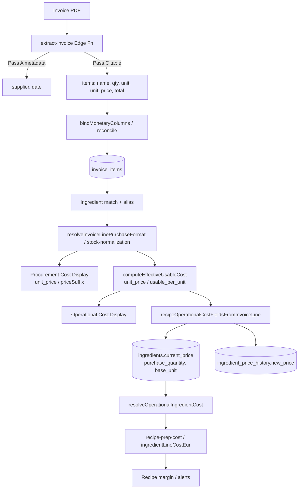

# Procurement vs Operational Cost Architecture Audit

**Validation Lab:** `bjhnlrgodcqoyzddbpbd`  
**Mode:** READ-ONLY  
**Date:** 2026-06-25

---

## Executive Summary

- **Procurement Cost** and **Operational Cost** are **separate display concepts** with distinct formulas, but they share a single price input (`invoice_items.unit_price`) and there is **no persisted `procurement_cost` column** — only operational economics are stored (`current_price` + `purchase_quantity` + `base_unit`).
- **Operational Cost** is derived independently via stock normalization (`computeEffectiveUsableCost` = `unit_price ÷ usable_per_priced_unit`), not from the procurement label. Recipe costing uses operational fields exclusively (`effectiveIngredientUnitCostEur` = `current_price ÷ purchase_quantity`).
- **VL validation (7 ingredients):** Peroni, Mozzarella Julienne, Aceto, Farina Pizza, Paccheri, and Gorgonzola are mathematically consistent with architecture; **Guanciale operational cost is wrong** (€6.18/kg vs expected €10.83/kg) due to usable-quantity bug (10.5 kg vs ~6 kg), not procurement→operational coupling.
- **Future scenarios:** Architecture supports multipack normalization (bottles, cases, bags) today; **yield/waste/edibleYieldPercent are not wired** — only type scaffolding exists.
- **Recommendation:** **No architectural redesign recommended.** Smallest fixes are upstream (Guanciale usable normalization, Gorgonzola unit_price extraction) — not splitting procurement/operational pipelines.

---

## Independence Verdict: **PARTIAL**

| Dimension | Independent? | Evidence |
|-----------|:------------:|----------|
| Display formulas | **Yes** | Procurement = `unit_price / priceSuffix`; Operational = `unit_price / usable_per_unit` (`invoice-purchase-price-semantics.ts:517-547`, `1221-1249`) |
| Recipe costing source | **Yes** | Uses `recipeOperationalCostFieldsFromInvoiceLine` → `effectiveIngredientUnitCostEur`, never procurement label |
| Price input | **No** | Both use same `unit_price`; operational is not `f(procurement_label)` |
| Persistence | **No** | No `procurement_cost` column; `current_price` stores pack price; `purchase_quantity` encodes operational denominator |
| kg-priced collapse | **Degenerate** | kg rows: both show identical €/kg (`.tmp/ingredient-procurement-operational-duplication-audit/REPORT.md`) |

**Conclusion:** Conceptually independent derivation paths; implementation shares `unit_price` and persisted fields are operational-shaped. Independence holds for multipack transforms (Peroni €1.07/bottle → €3.24/L) but collapses for kg-priced deli (Gorgonzola €10.88/kg = €10.88/kg).

---

## 1. Procurement Cost — All Production Locations

### Core derivation (single source)

| Location | Role | Source | Formula | Persisted? |
|----------|------|--------|---------|:----------:|
| `resolveInvoiceLinePricingPresentation` | Invoice Review display | `invoice_items.unit_price` | `formatUnitCostCurrency(unit_price) / priceSuffix` | No |
| `resolvePurchaseCostLabels` | Ingredient purchase memory | Same presentation | `presentation.priceDisplay` | No |
| `buildLastPurchaseCostPresentation` | Ingredient detail UI | Purchase memory row | Passthrough `procurementCostLabel` | No |
| `procurementPackFieldsFromInvoiceLine` | Catalog sync | `invoice_items.unit_price` | `current_price = unit_price` | **Yes** → `ingredients.current_price` |
| `syncIngredientProcurementPrice` | History-linked refresh | Latest matched invoice line | Same as above | **Yes** |

### Proven Facts

- Procurement Cost = **Invoice Unit Price** (Option A), NOT `line_total ÷ qty` (`.tmp/procurement-cost-economics-audit/REPORT.md`)
- `priceSuffix` from `resolvePriceSuffix` — pack container (bottle, case, bag, kg) from row unit, `packageType`, name patterns (`invoice-purchase-price-semantics.ts:305-319`)
- **No SQL views** compute procurement cost. DB stores raw `invoice_items.unit_price`.

### Hypotheses

- Procurement label semantics are sufficient for Purchase Unit Intelligence without a separate persisted column — not proven; only display path exists today.

### Architectural Assessment

Procurement cost is a **display-layer concept** anchored on raw invoice unit price. Persistence reuses `current_price` (pack price), not a dedicated procurement field.

### Blast Radius

**Low** for display correctness; **Medium** for future Purchase Unit Intelligence if pack semantics are inferred only from labels.

### Recommendation

No implementation recommended for procurement persistence unless Purchase Unit Intelligence requires historical pack-price queries independent of operational normalization.

---

## 2. Operational Cost — All Production Locations

| Location | Role | Source | Formula | Persisted? |
|----------|------|--------|---------|:----------:|
| `computeEffectiveUsableCost` | Core transform | `unit_price` + stock normalization | `unit_price / usable_per_priced_unit` (→ €/kg, €/L, €/unit) | No (display) |
| `recipeOperationalCostFieldsFromInvoiceLine` | Catalog persist + recipe | Same + `resolveUsablePerPricedUnit` | `{current_price: unit_price, purchase_quantity: usable_amount, cost_base_unit}` | **Yes** |
| `operationalCostFieldsFromInvoiceLine` | Auto-persist wrapper | Delegates to recipe function | Same | **Yes** |
| `effectiveIngredientUnitCostEur` | Recipe line cost | Persisted fields | `current_price / purchase_quantity` | Derived on read |
| `resolveComparablePurchasePrice` | Purchase intelligence | `computeEffectiveUsableCost` | Operational €/base-unit for trends | No |
| `operationalUnitPriceForPriceHistory` | Price history | Pack + denominator | `resolvedOperationalUnitCostEur` | **Yes** → `ingredient_price_history.new_price` (€/g) |

### Proven Facts

- **kg-row short-circuit** (`recipeOperationalCostFieldsFromInvoiceLine`, L665-667): `rowUnit === "kg"` → `{current_price: unit_price, purchase_quantity: 1000, cost_base_unit: "g"}`
- **Countable multipack** (Peroni, Paccheri): `resolveOperationalUsablePerPricedUnit` scales total usable to per-priced-unit for display (`invoice-purchase-price-semantics.ts:454-477`)
- **Independence from procurement label:** Operational cost is computed from `unit_price` and `resolveInvoiceLinePurchaseFormat` — never reads `priceDisplay`

### Hypotheses

- `purchase_quantity` dual semantics (catalog pack count vs operational denominator) may cause confusion when `shouldPreferCatalogPackFieldsForPersist` applies — requires case-by-case validation.

### Architectural Assessment

Operational cost is the **economics layer** for recipe costing, purchase intelligence, and price history. Derivation is independent of procurement display labels.

### Blast Radius

**High** when upstream usable-quantity normalization fails (Guanciale case).

### Recommendation

No architectural change. Fix normalization defects at stock-parse/persist boundary.

---

## 3. Full Pipeline (Invoice → Recipe Costing)



### Transformations

1. OCR extracts raw monetary columns
2. `bindMonetaryColumns` may rebind `unit_price` when `total < qty×gross` (discount)
3. Stock normalization parses pack structure from name (`*24`, `25kg`, `5l*2`)
4. Procurement display = raw pack price label
5. Operational = pack price ÷ normalized usable per priced unit
6. Persist operational triple; recipe divides again at usage time

---

## 4. VL Validation — 7 Ingredients

### Summary Table

| Ingredient | Invoice (qty / unit_price / total) | Procurement | Operational | Math OK? | Notes |
|------------|-----------------------------------|-------------|-------------|:--------:|-------|
| **Guanciale** | 5.996 un / €10.83 / €64.93 | €10.83/unit | €6.18/kg | **NO** | Usable 10.5 kg should be ~6 kg → expected €10.83/kg |
| **Mozzarella Julienne** | 10 un / €20.03 / €200.30 | €20.03/bag | €6.68/kg | **YES** | 10×3 kg = 30 kg; €200.30÷30 = €6.68 |
| **Peroni** | 24 un / €1.07 / €25.69 | €1.07/bottle | €3.24/L | **YES** | 24×330 ml = 7.92 L; €1.07÷0.33 L |
| **Aceto Balsamico** | 1 un / €15.55 / €16.09 | €15.55/unit | €1.56/L | **YES** | 2×5 L = 10 L; €15.55÷10 L (total has 3.4% discount variance) |
| **Farina Pizza** | 1 un / €26.52 / €25.52* | €26.52/bag | €1.06/kg | **YES** | 25 kg bag; €26.52÷25 (*total reflects discount) |
| **Gorgonzola** | 1.05 kg / €10.88 / €13.44 | €10.88/kg | €10.88/kg | **Partial** | Formula consistent; unit_price ≠ total÷qty (15% gap) |
| **Paccheri** (De Cecco) | 24 / €2.10 / €50.40 | €2.10/unit | €4.20/kg | **YES** | 24×500 g = 12 kg; €50.40÷12 |

*Sources: `.tmp/quantity-mismatch-ui-audit/replay.json`, `.tmp/vl-final-state-audit/extracts/36c99d19*.json`, `.tmp/procurement-cost-economics-audit/REPORT.md`, `invoice-purchase-price-semantics.test.ts`*

### Guanciale — Mathematical Validation

```
Commercial: €64.93 ÷ 5.996 kg = €10.83/kg (ground truth)
System:     €64.93 ÷ 10.5 kg = €6.18/kg (wrong usable)
Procurement: €10.83/unit (mislabeled; invoice is €/kg)
```

**Classification:** Normalization bug (Stage 8 stock), NOT procurement→operational coupling.

### Gorgonzola — Mathematical Validation

```
qty × unit_price = 1.05 × 10.88 = €11.42 ≠ €13.44 total
Effective paid = 13.44 ÷ 1.05 = €12.80/kg (not displayed)
Displayed both = €10.88/kg (kg short-circuit)
```

---

## 5. Future Scenario Stress Test

| Scenario | Architecture holds? | Mechanism |
|----------|:-------------------:|-----------|
| Yield 20 kg → 16 kg usable | **No** | `edibleYieldPercent` type exists, not wired |
| 24 × 330 ml bottles | **Yes** | Peroni proven |
| 2 × 5 L containers | **Yes** | Aceto proven |
| 25 kg flour bag | **Yes** | Farina proven |
| 6 × 1.5 kg pieces | **Partial** | Works for Rulo capra; Guanciale fails on generic-row + fractional qty |
| Prep recipes (Purchased → Prep → Recipe) | **Yes** | `recipe-prep-cost.ts` separate cascade |
| Waste/shrinkage | **No** | No shrinkage field in `computeEffectiveUsableCost` |

**Independence under future scenarios:** Procurement (pack price) and Operational (usable-normalized) remain conceptually separable; yield/waste would extend operational denominator without changing procurement formula.

---

## 6. Architectural Coupling Audit

### Safe Patterns (Proven)

- Display collapse rule only on Invoice Review (`shouldCollapseInvoiceOperationalDisplay`) — ingredient detail always shows both
- Recipe costing never reads display labels
- Purchase intelligence `comparablePrice` uses operational cost, not line total (post-refactor intent in `ingredient-purchase-memory.ts:60-91`)

### Coupling Risks

| Pattern | Severity | Evidence |
|---------|----------|----------|
| `procurementPackFieldsFromInvoiceLine` → `operationalCostFieldsFromInvoiceLine` | Medium | Same function for `current_price` |
| kg-row operational = procurement | Low | By design for €/kg invoices |
| Shared `unit_price` input | Medium | Both fail together on extraction defects (Gorgonzola) |
| Catalog `purchase_quantity` dual semantics | Medium | Peroni: 24 un (catalog) vs 7920 ml (operational) — `shouldPreferCatalogPackFieldsForPersist` |

### Top 3 Architectural Risks

1. **No separate procurement persistence** — `procurementPackFieldsFromInvoiceLine` delegates to `operationalCostFieldsFromInvoiceLine` for `current_price` (`ingredient-auto-persist.ts:172-197`). Procurement is display-only; conflating “last paid pack price” with operational catalog fields can confuse future Purchase Unit Intelligence.
2. **Usable-quantity upstream errors propagate to operational cost only** — Guanciale proves operational math is internally consistent (`opMatchesTotalOverUsable: true` in `.tmp/quantity-mismatch-ui-audit/replay.json`) but commercially wrong when normalization fails. Blast radius: **High** for recipe costing.
3. **Yield/waste not implemented** — `edibleYieldPercent` exists in `IngredientUnitMetadata` (`ingredient-unit-cost.ts:33`) but is unused in `computeEffectiveUsableCost`. Future 20 kg → 16 kg usable requires new field/wiring without redesigning the dual-cost model.

---

## 7. Persistence Audit

| Field | What it stores | Procurement or Operational? |
|-------|---------------|----------------------------|
| `invoice_items.unit_price` | Raw invoice pack price | Procurement input |
| `invoice_items.total` | Line total paid | Neither (audit trail) |
| `ingredients.current_price` | Latest pack price | Both (same value) |
| `ingredients.purchase_quantity` | Operational denominator OR catalog pack count | **Operational** (mostly) |
| `ingredients.base_unit` | g / ml / un | Operational |
| `ingredient_price_history.new_price` | €/base-unit (operational) | **Operational** |
| Procurement Cost label | — | **Not persisted** |

### Proven Facts

- **Inconsistency risk:** Yes — if stock normalization wrong at persist time, catalog fields encode wrong operational economics until re-ingest. No drift between display and persist for operational (same functions).
- **Single source of truth:** `invoice_items` for raw facts; `ingredients` for latest operational economics; display recomputed on read.

---

## 8. Future Compatibility

| Feature | Ready? | Notes |
|---------|:------:|-------|
| Purchase Unit Intelligence | Partial | Pack structure parsing exists; procurement label semantics defined |
| Yield / Waste | No | Type scaffold only |
| Supplier packaging changes | Yes | Re-normalize on new invoice line |
| Prep recipes | Yes | `recipe-prep-cost.ts`, `recipe-prep-yield.ts` |
| Recipe cascading | Yes | Prep propagation in `recipe-prep-cost.ts` |
| Historical pricing | Partial | Stores operational €/g; Gorgonzola/Guanciale poison if bad inputs |

---

## Final Verdict

**Architecture: ROBUST** for stated future work — dual-cost model is correct; failures are normalization/extraction, not conceptual coupling.

**Recommendation: No implementation recommended** for procurement/operational split. Fix Guanciale usable normalization and Gorgonzola unit_price extraction as isolated defects.
