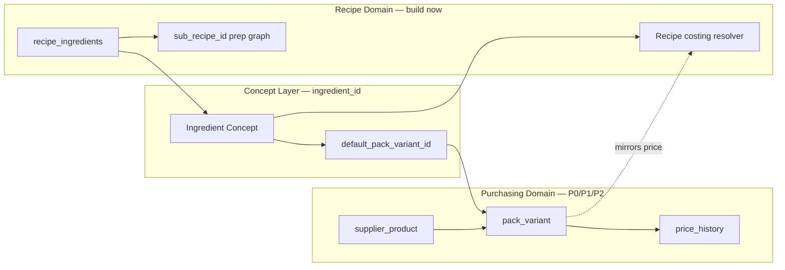

# Recipe Architecture Compatibility Audit

**Generated:** 2026-06-13  
**Mode:** READ-ONLY — no code, deploy, commit, or implementation.

---

## Primary Question

**Will future Ingredient Identity changes (Option E) require recipe architecture rewrites?**

**NO (87% confidence)** — if recipes bind to **Ingredient Concept** (current `ingredient_id`). Expect a **costing resolver adapter**, not a schema rewrite. Prep/sub-recipe graph is **orthogonal** to pack variants.

---

## Executive Answer

| Question | Answer | Confidence |
|----------|--------|------------|
| Start Prep/Sub-Recipes now? | **YES** (with costing caveats) | 86% |
| Identity blocker for recipe architecture? | **NO** for structure; **PARTIAL** for multi-format costing trust | 84% |
| Major rewrite probability (concept binding) | **12%** | 83% |
| Next dev session | **P0 identity guard first**, then prep in parallel | 88% |

---

## Current Recipe Architecture (codebase)

```
recipe_ingredients
  ├── ingredient_id  → ingredients (name, current_price, purchase_quantity)
  └── sub_recipe_id  → recipes(id) where type=prep

Costing: resolveRecipeLineOperationalCost → current_price / purchase_quantity
Prep:    sub_recipe_id → recipe-merge recursive walk → batch / output_quantity
```

**Already implemented:** XOR constraint, `output_quantity`/`output_unit`, prep propagation, circular detection, `recipes.tsx` prep picker.

**Not in codebase:** `pack_variant_id`, `supplier_product_id` — identity layer is purchasing-side only in future design.

---

## Recipe Binding Options Evaluated

| Option | Costing | Prep | History | Migration | UX | Ops | **Total** | Verdict |
|--------|---------|------|---------|-----------|-----|-----|-----------|---------|
| **A Concept** | 4 | 5 | 4 | 5 | 5 | 4 | **4.5** | **RECOMMENDED** |
| B Supplier Product | 2 | 3 | 5 | 2 | 2 | 2 | 2.7 | Reject for recipes |
| C Pack Variant | 5 | 4 | 5 | 3 | 2 | 3 | 3.7 | Optional override only |

### A — Recipes → Ingredient Concept (recommended)

- `recipe_ingredients.ingredient_id` stays; semantic role becomes "concept"
- Costing via `concept.default_pack_variant_id` (future) or mirrored `current_price` (transition)
- Menu recipes think in mozzarella, not "Aviludo 2kg block SKU"

### B — Recipes → Supplier Product (reject)

- Locks menu to one supplier — rewrite on every switch
- Belongs in purchasing/invoice match only

### C — Recipes → Pack Variant (optional P3)

- Nullable `recipe_ingredients.pack_variant_id` for power users
- Not default UX — too granular for chefs

---

## Recommended Separation of Responsibilities

| Domain | Binds to | Owns |
|--------|----------|------|
| **Recipes / Prep** | Ingredient Concept | Culinary quantities, margins, prep graph |
| **Purchasing / Invoices** | Supplier Product → Pack Variant | Match, aliases, `price_history` |
| **Operational Intelligence** | Pack Variant (movements) + Concept (recipe exposure) | Opportunities, supplier watch |

```
┌─────────────────┐     default variant      ┌──────────────────┐
│  recipe_ingredients │ ──────────────────────→ │  pack_variant    │
│  .ingredient_id   │                         │  (price, pq)     │
│  (CONCEPT)        │                         └────────▲─────────┘
└─────────────────┘                                  │
                                                     invoice match
┌─────────────────┐                                  │
│  sub_recipe_id  │  (prep graph — no variant)       │
└─────────────────┘                          supplier_product
```

---

## Core Questions

### 1. If Pack Variants introduced later, what breaks in recipes?

**Minimal breakage (87%):**

| Breaks | Does NOT break |
|--------|----------------|
| `resolve-operational-ingredient-cost.ts` — read variant price | `recipe_ingredients.ingredient_id` FK |
| `buildOperationalIngredientCostById` — variant fields | `sub_recipe_id` prep graph |
| `ingredients.current_price` dual-write deprecation | `recipe-merge` walk structure |
| | Margin formula, OI recipe exposure by concept |

### 2. Can recipes stay on Concept while purchases move to Pack Variants?

**YES (91%)** — intended Option E design. Purchasing updates variant price; recipe resolver reads concept's default variant.

### 3. Will costing stay correct when `current_price` is derived from variants?

**YES with stable default (80%)**. VL Mozzarella risk: wrong default variant (block €13.69 vs piece €0.95). Mitigation: `default_pack_variant_id` + optional line override.

### 4. Can prep/sub-recipes be built now without future rewrites?

**YES (88%)**. `sub_recipe_id`, `output_quantity`, prep propagation, and recursive costing are **already orthogonal** to pack variants. Leaf prep lines use concept `ingredient_id` — same resolver adapter applies.

### 5. Would building recipes now create technical debt?

**LOW–MEDIUM (82%)** if:
- Bind to `ingredient_id` (concept)
- Cost through `resolveRecipeLineOperationalCost` / `recipe-merge`
- Never bind recipes to supplier products

**HIGH debt** only if recipes lock to supplier SKUs or bypass resolvers.

---

## VL Failure Validation

| Case | Recipe schema change? | Purchasing/history change? |
|------|----------------------|---------------------------|
| Mozzarella piece vs block | **No** | **Yes** — split variants; recipe uses concept + default variant |
| Pepino fresco vs conserva | **No** | **Yes** — form guard / concept split; recipe uses conserva concept |
| Ginger Beer `0.20cl` | **No** | **Yes** — variant `volume_ml_per_unit`; extraction parse |

All three VL failures are **purchasing identity problems**, not recipe architecture problems.

---

## Future Migration Impact

### Recipes

| Aspect | Impact |
|--------|--------|
| Schema | No change required (optional `pack_variant_id` nullable in P3) |
| Code | Resolver adapter in 2–3 files |
| Data | `default_pack_variant_id` backfill per concept |
| UX | Concept picker unchanged; advanced variant picker additive |

### Prep / Sub-Recipes

| Aspect | Impact |
|--------|--------|
| Schema | **None** |
| Code | **None** for graph; leaf costing via same resolver |
| Data | **None** |
| UX | **None** |

---

## Technical Debt Risk If Recipe Work Starts Now

| Scenario | Rewrite probability |
|----------|---------------------|
| Concept binding + resolver pattern | **12%** |
| Scattered `current_price` reads in UI | 35% |
| Required `pack_variant_id` on every line | 45% |
| Supplier product binding on recipes | **85%** |

---

## Alignment with Ingredient Identity Future Design

Per `.tmp/ingredient-identity-future-design/`:

1. **P0 guard first** — stops false OI signals; does not block prep work
2. **P1 pack variants** — resolver reads default variant; recipes unchanged
3. **Prep/sub-recipes parallel** — structural work can proceed during P0/P1

### Next dev session recommendation

| Priority | Work |
|----------|------|
| **1** | P0 cross-format history chain guard (1–2 days) |
| **2** | Prep/sub-recipe features in parallel (graph, UI, costing display) |
| **3** | P1 pack_variants schema |
| **After P1** | Wire recipe resolver to `default_pack_variant_id` |

**Do not enable** recipe cost alerts tied to `price_history` until P0+P1 complete.

---

## What to Build Now vs Defer

### Safe to build now

- Prep recipe CRUD (`type=prep`)
- `sub_recipe_id` line picker
- `output_quantity` / `output_unit`
- Prep batch + parent usage costing
- Circular prep detection
- Prep cascade in margin alerts

### Build with caution

- Recipe food cost when concept has multiple pack formats (manual catalog hygiene until P1)
- Price-change → recipe recalc (accurate after P0+P1)

### Defer until identity P0+P1

- Recipe-level supplier switch recommendations
- Historical price movement on recipe cards
- Auto-suggest ingredient from invoice on recipe add

---

## Artifacts

| File | Contents |
|------|----------|
| `compatibility-matrix.json` | Binding options A/B/C scored + core Q&A |
| `future-state-model.json` | Domain separation + resolver adapter pattern |
| `migration-risk.json` | Risk matrix + debt scenarios |
| `executive-summary.json` | Final answers + next session recommendation |
| `REPORT.md` | This document |

---

## Architecture Diagram



**Key insight:** Solid vertical line between recipe domain (left) and purchasing domain (right). Only the resolver bridge crosses — and that bridge is an adapter, not a rewrite.
