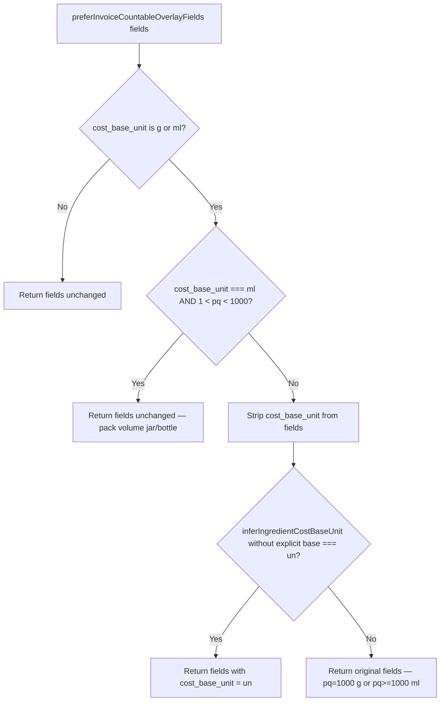

# Recipe Overlay Decision Audit

**Validation Lab:** `bjhnlrgodcqoyzddbpbd` · **2026-06-25T13:11:40Z**  
**Mode:** STRICT READ-ONLY — no code, data, or DB changes

## Certification Question

Is `preferInvoiceCountableOverlayFields()` still architecturally correct before implementing a recipe cost fix?

**Answer: Partially — verdict B (correct idea, overly broad).** The function solves a real legacy mis-tag problem (brioche 80g/un) but its strip-and-reinfer heuristic also corrupts legitimate gram-denominator invoice overlays (Manjericão, Salada ibérica). Ginger beer is a separate failure: this function correctly preserves `ml`, but invoice ml wins over catalog `un` with no conversion bridge.

**Confidence:** 88%

---

## Phase 1 — Historical Intent

| Field | Value |
|-------|-------|
| Introduced | `7bb9d604` — 2026-05-26, *refactor(recipe-workspace): operational full-width costing layout* |
| File | `src/lib/resolve-operational-ingredient-cost.ts:152-170` |
| Author comment | *"Invoice overlay sometimes carries a legacy mass cost_base_unit while pack size is countable (un). Prefer countable invoice semantics without changing pack price / quantity normalization."* |

### Problem it was created to solve

When operational costing gained explicit `cost_base_unit` on invoice overlays, some countable products (buns, cans, bottles) were persisted with `cost_base_unit: "g"` or `"ml"` while `purchase_quantity` held per-piece weight/volume (e.g. brioche pq=80). Recipe lines in `un` could not use `directCountableLineCostEur` because the resolved base stayed in the weight family.

The unit test *"prefers invoice un overlay over legacy catalog mass base for countable bun"* documents the intended fix: invoice `g/80` → `un/80` so a recipe line `1 un` resolves at €0.21/bun.

`repairCountableEmbeddedWeightDenominator` (same normalization pass) then repairs pq=80 → pq=1 + `usable_weight_grams: 80` when the ingredient name embeds the gram measure.

---

## Phase 2 — Decision Tree

### Branch reference

| # | Condition | Action | Expected scenario |
|---|-----------|--------|-------------------|
| 1 | `cost_base_unit` ∉ {g, ml} | No-op | Mozzarella `un`, Anchoas `un` |
| 2 | `cost_base_unit === ml` AND `1 < pq < 1000` | No-op | Mayo 450 ml jar; Ginger beer 200 ml/bottle |
| 3 | Strip base → infer → `un` | Rewrite to `un` | **Brioche pq=80 (intended)**; **Manjericão pq=100, Salada pq=250 (BUG)** |
| 4 | Strip base → infer → `g` or `ml` | Keep original | Mortadella pq=1000; Aceto pq=10000 ml |

**Invocation points:** `normalizeCountableOperationalCostFields` runs twice inside `resolveOperationalIngredientCostFields` — once on raw invoice fields (line 244) and again after `mergeOperationalCostMetadata` (line 283). `mergeOperationalCostMetadata` does **not** merge `cost_base_unit` from catalog.

---

## Phase 3 — Real Callers

| Caller | Why invoked | Still needs this behavior? |
|--------|-------------|---------------------------|
| `normalizeCountableOperationalCostFields` | Wraps prefer + `repairCountableEmbeddedWeightDenominator` | **Yes** — brioche/lata paths still mis-tagged at invoice layer |
| `resolveOperationalIngredientCostFields` | Canonical invoice → catalog → embed resolver | **Yes** — but should call a **narrowed** preferCountable |
| `resolveRecipeLineOperationalCost` | Recipe line € via `ingredientLineCostEur` | Indirect — inherits resolved base |
| `enrichRecipeLinesForOperationalCost` | Hydrate recipe embed before UI/PDF | Indirect |
| `operationalIngredientCostFieldsForLine` | Single-ingredient field lookup | Indirect |
| `recipes.tsx` | Recipe workspace costing, detail panel unit display | Indirect |
| `margin-alert-data.ts` | Margin alert food-cost recompute | Indirect |

**Direct export consumers:** `resolve-operational-ingredient-cost.test.ts` only (brioche + mayo regression tests).

**Not called from:** `invoices.tsx`, `ingredients.tsx`, `ingredient-operational-intelligence.ts`, procurement parsers. Invoice review displays raw `operationalCostFieldsFromInvoiceLine` output — unaffected.

---

## Phase 4 — Replay PASS vs FAIL

### FAIL lines

| Ingredient | Before prefer | After prefer | Resolved base | lineCost | First divergence |
|------------|---------------|--------------|---------------|----------|------------------|
| Manjericão 12 g | `g/100` | **`un/100`** | `un` | null | `preferInvoiceCountableOverlayFields: g→un` |
| Salada ibérica 100 g | `g/250` | **`un/250`** | `un` | null | `preferInvoiceCountableOverlayFields: g→un` |
| Ginger beer 6 un | `ml/200` | `ml/200` (unchanged) | `ml` | null | `invoice_overlay_base_ml_vs_catalog_un` |

Unit costs resolve (€0.0206/g, €0.00876/g, €0.00405/ml). Failure is strictly at recipe line multiplication — not missing pack price.

### PASS comparators

| Ingredient | Before → After | pq | preferBranch | lineCost | Why PASS |
|------------|----------------|-----|--------------|----------|----------|
| Mortadella 80 g | `g/1000` → `g/1000` | 1000 | mass_base_preserved | €0.7992 | pq=1000 → infer returns g even after strip |
| Gorgonzola 30 g | `g/1000` → `g/1000` | 1000 | mass_base_preserved | €0.2985 | Same kg-denominator rule |
| Mozzarella 2 un | `un/1` → `un/1` | 1 | early_exit | €16.24 | Already countable base |
| Anchoas 3 un | `un/1` → `un/1` | 1 | early_exit | €29.97 | direct_countable |
| Aceto 15 ml | `ml/10000` → `ml/10000` | 10000 | mass_base_preserved | €0.0241 | Volume families match |

**Peroni** is not in VL-E2E recipes but is covered by `invoice-purchase-price-semantics.test.ts` (24 un @ €1.07, operational L) and quantity-mismatch audit — same multipack class as Ginger beer; `preferInvoiceCountableOverlayFields` preserves ml when pq=330 (33cl).

**First divergence pattern:** FAIL gram-produce diverges at branch 3 (pq ∈ (1, 999)); Ginger beer diverges at invoice-priority layer (ml overlay vs catalog un), not inside preferCountable.

---

## Phase 5 — Still Valid?

| Code | Verdict | Fit |
|------|---------|-----|
| A still correct, failures elsewhere | Partial | True for Ginger beer only |
| **B correct idea, overly broad** | **Selected** | Brioche problem real; pq<1000 heuristic too aggressive |
| C legacy workaround, original bug gone | No | Brioche test still expects g→un |
| D architectural mistake, never rewrite | No | Rewriting is correct for true mis-tags |

**Selected: B** — Keep the function, narrow when it may strip an explicit gram base that catalog and invoice parser agree on.

---

## Phase 6 — Smallest Correction (DO NOT implement)

### Fix 1 — Manjericão & Salada (inside `preferInvoiceCountableOverlayFields`)

Do **not** enter strip-and-reinfer when:
- Invoice overlay already has `cost_base_unit: "g"`, **and**
- Catalog (or upstream parser) agrees on `g`, **or**
- `purchase_quantity` is a gram pack denominator (100, 250) without countable name embed

Minimal guard (~1 condition): `if (fields.cost_base_unit === "g") return fields` when catalog fallback also has `g` — or only strip when `isCountableProductName` / embedded weight matches pq (brioche pattern).

**Expected:** 12 g × €0.0206 = **€0.2472**; 100 g × €0.00876 = **€0.876**

### Fix 2 — Ginger beer (outside preferCountable)

When recipe unit is `un`, catalog `cost_base_unit` is `un`, and invoice overlay is `ml` with per-bottle pq (200 ml): use catalog countable fields for line costing **or** set `usable_volume_ml: 200` on overlay so `directCountableLineCostEur` can bridge.

**Expected:** 6 × €0.81/bottle = **€4.86**

Both fixes together → 12/12 recipes PASS, 34/34 lines PASS.

---

## Phase 7 — Regression Assessment

| Area | Risk | Notes |
|------|------|-------|
| Recipe costing | **High risk** | Primary consumer; changes resolved `cost_base_unit` |
| Invoice review | **Safe** | Does not call preferCountable |
| Ingredient costs (UI) | **Needs regression** | `recipes.tsx` operational unit display |
| Operational normalization | **Needs regression** | Brioche, mayo 450 ml, Peroni multipack |
| Validation engine | **Safe** | Read-only audits |
| Procurement | **Safe** | No dependency |
| History | **Safe** | Recipe path never reads `ingredient_price_history` |
| Margin alerts | **Needs regression** | `margin-alert-data.ts` |

---

## Parent Agent Return

1. **Why does function exist?** Correct legacy invoice overlays that mis-tag countable packs (bun/can) with `cost_base_unit: g/ml` so recipe lines in `un` can use countable costing.

2. **Still correct?** **B** — correct idea, overly broad.

3. **Exact function + file + lines:** `preferInvoiceCountableOverlayFields` — `src/lib/resolve-operational-ingredient-cost.ts:152-170`

4. **Affect anything outside recipe costing?** **Indirectly yes** — only via `resolveOperationalIngredientCostFields` in `recipes.tsx` (unit display) and `margin-alert-data.ts`. Invoice review, procurement, and history are unaffected.

5. **Smallest safe correction:** Preserve explicit invoice `g` when catalog agrees (fixes Manjericão/Salada); for Ginger beer, prefer catalog `un` or bridge ml→un when recipe is `un` (separate one-liner in resolver or merge).

6. **Confidence:** **88%**

---

## Evidence

- Audit script: `.tmp/recipe-overlay-decision-audit/audit.mts`
- Results: `.tmp/recipe-overlay-decision-audit/results.json`
- Prior audits: `.tmp/recipe-cost-resolution-audit/REPORT.md`, `.tmp/end-to-end-recipe-certification/REPORT.md`
- Unit tests: `resolve-operational-ingredient-cost.test.ts` (brioche, mayo)
